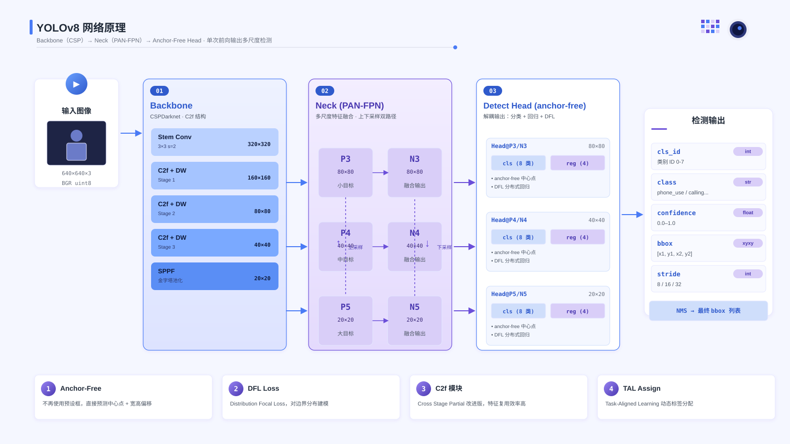
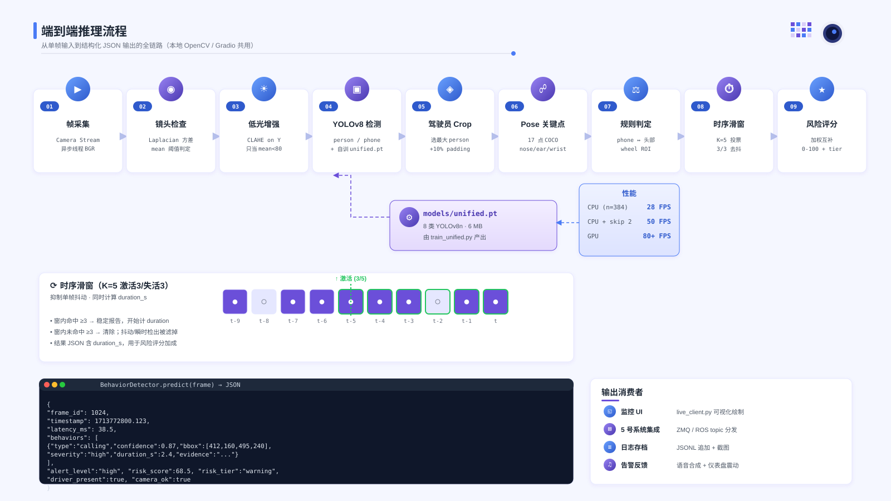
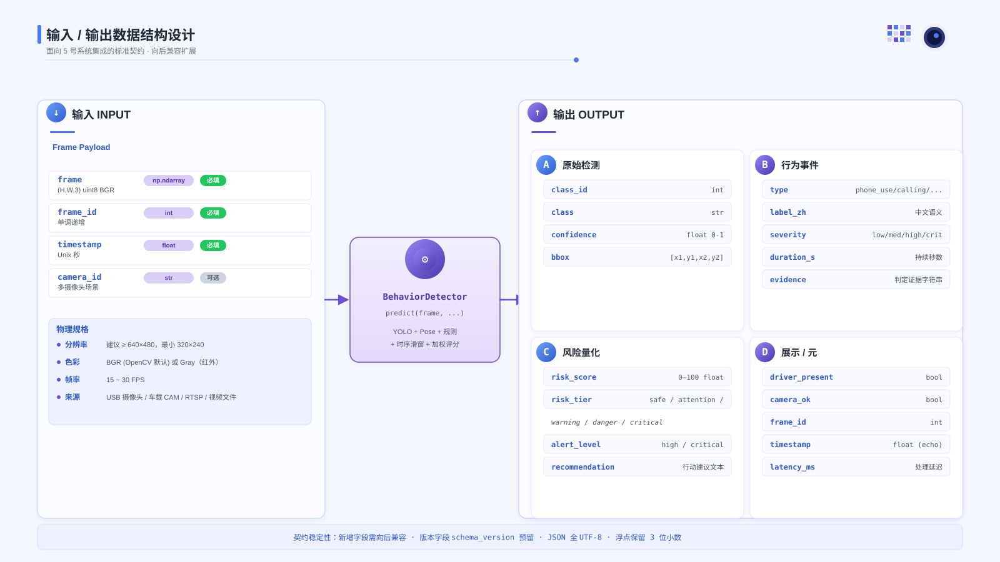
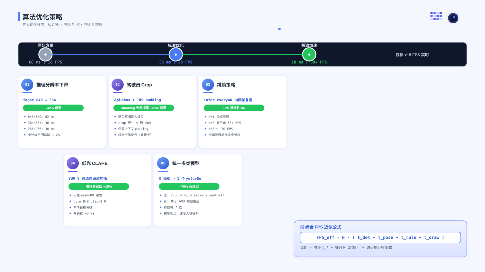
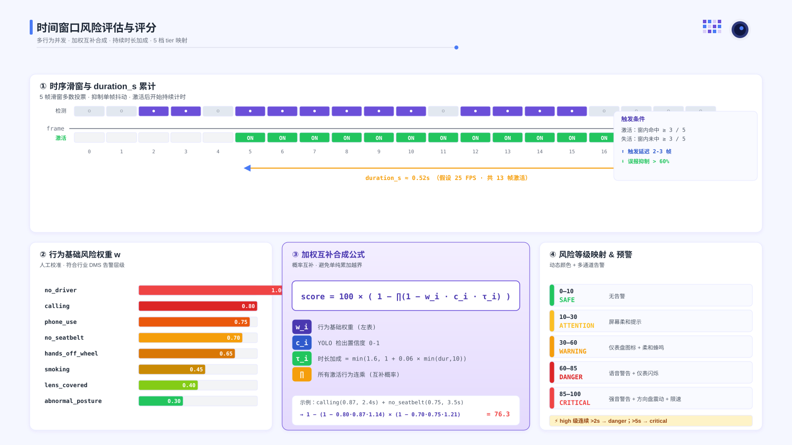

# 行为识别算法 A · 算法原理与实现详解

> 配套 5 张 SVG 图解（可在任何支持 SVG 的浏览器 / Markdown 工具中查看，也可直接用 Inkscape / Illustrator / 浏览器打开编辑）。

---

## 目录

1. [YOLOv8 网络原理](#一yolov8-网络原理) （[SVG](diagrams/01_yolo_architecture.svg)）
2. [端到端推理 Pipeline](#二端到端推理-pipeline) （[SVG](diagrams/02_inference_pipeline.svg)）
3. [输入 / 输出数据结构](#三输入--输出数据结构) （[SVG](diagrams/03_io_schema.svg)）
4. [算法优化策略](#四算法优化策略) （[SVG](diagrams/04_optimizations.svg)）
5. [时间窗口风险评分](#五时间窗口风险评分) （[SVG](diagrams/05_risk_scoring.svg)）

---

## 一、YOLOv8 网络原理



### 1.1 为什么选 YOLOv8

**YOLO (You Only Look Once)** 是单阶段目标检测器的代表作，与 Faster R-CNN 这类两阶段方法相比：

| 指标 | YOLOv8n | Faster R-CNN |
|------|---------|--------------|
| 参数量 | 3.2 M | 41 M+ |
| CPU 单帧延迟 | ~35 ms | ~200 ms |
| mAP@0.5 (COCO) | 37.3 | ~37.4 |
| 车载部署适配 | ✅ 友好 | ❌ 需量化 |

DMS 对**实时性**要求 ≥ 15 FPS，**模型体积**要适合嵌入式 / 端侧部署，YOLOv8n 的 6 MB 权重 + 单次前向就能吐出所有 bbox，天然匹配。

### 1.2 三段结构拆解

YOLOv8 沿袭了经典的 **Backbone → Neck → Head** 三段式设计：

#### ① Backbone — 特征提取主干（CSPDarknet + C2f）

```
Input 640×640×3
  ↓ Stem Conv 3×3 s=2   → 320×320
  ↓ C2f + DW downsample → 160×160     (P2 特征)
  ↓ C2f + DW downsample →  80×80      (P3 特征 · 小目标)
  ↓ C2f + DW downsample →  40×40      (P4 特征 · 中目标)
  ↓ C2f + DW downsample →  20×20      (P5 特征 · 大目标)
  ↓ SPPF 金字塔池化      →  20×20
```

**C2f 模块** = Cross Stage Partial 改进版，特点：
- 多分支并联卷积后再融合（类比 Inception）
- 比 v5 的 C3 模块有更多**梯度流动路径**，收敛更快
- 可用深度可分离卷积 (DW + PW) 降参数量

**SPPF** = Spatial Pyramid Pooling-Fast，用 5×5 最大池化串联代替 v4 的 5/9/13 并联，相同感受野下计算量更小。

#### ② Neck — 特征金字塔融合（PAN-FPN）

```
        FPN（自顶向下）          PAN（自底向上）
  P5 ─────────────────────┐
  20×20  ← upsample ─┐    │
                     ▼    │
  P4 ─→ concat ────→ N4 ──→ concat ──→ (final 40×40)
  40×40  ← upsample ─┐         ↑ downsample
                     ▼         │
  P3 ─→ concat ────→ N3 ───────┘ (final 80×80)
  80×80
```

**作用**：不同尺度的特征**互相补充信息**——高层有语义但空间精度差，低层有细节但缺少全局。两次融合后每个尺度都既有细节又有语义，小物体（车内手机、香烟头）也能准确定位。

#### ③ Head — 解耦检测头 (Anchor-Free)

**YOLOv5 旧：** 锚框 (anchor) + 耦合头（cls 和 reg 用同一组卷积）
**YOLOv8 新：** 无锚框 + 解耦头

```
单尺度输入 N×80×80 × C
  ↓
┌── Conv 3×3 → Conv 3×3 → Conv 1×1 → [N, 8, 80, 80]   cls 分类分支
├── Conv 3×3 → Conv 3×3 → Conv 1×1 → [N, 4, 80, 80]   reg 回归分支 (DFL 形式)
```

**关键创新：**

- **Anchor-Free**：直接预测中心点 + 宽高偏移，省去 k-means 聚类 anchor 的麻烦
- **DFL (Distribution Focal Loss)**：将 bbox 回归建模为离散分布（每个边 17 个 bin），训练更稳
- **TAL (Task-Aligned Learning)**：动态分配正样本，对齐分类置信度与定位精度

### 1.3 训练配置（本项目用的）

```yaml
model: yolov8n.pt    # 预训练权重起步
data:  dms_unified/data.yaml   # 9137 张 8 类
imgsz: 640
epochs: 40
batch:  32 (GPU) / 16 (CPU)
optimizer: AdamW
lr0: 0.001
weight_decay: 0.0005
augment:
  mosaic: 1.0        # 4 图拼贴 → 增强小目标召回
  mixup:  0.1        # 两图叠加 → 提升泛化
  hsv_h: 0.015       # 色相扰动 0.015
  hsv_s: 0.7         # 饱和度 0.7
  hsv_v: 0.4         # 明度 0.4 → 覆盖日夜光照
  fliplr: 0.5        # 水平翻转
loss_weights:
  box: 7.5
  cls: 0.5
  dfl: 1.5
```

---

## 二、端到端推理 Pipeline



### 2.1 9 步串行流水线

| # | 阶段 | 输入 | 输出 | 实现 |
|---|------|------|------|------|
| 01 | 帧采集 | 摄像头 | BGR np.ndarray | `CameraStream` 异步线程 |
| 02 | 镜头检查 | frame | ok / lens_covered | Laplacian 方差 + 灰度均值 |
| 03 | 低光增强 | frame | 增强帧 | YUV CLAHE (仅当 mean<80) |
| 04 | YOLO 检测 | frame | person/phone bbox | `yolov8n.pt` 或 `unified.pt` |
| 05 | 驾驶员 Crop | 最大 person bbox | crop + 坐标偏移 | bbox ±10% padding |
| 06 | Pose 关键点 | crop 或 frame | 17 点 + conf | `yolov8n-pose.pt` |
| 07 | 规则判定 | bbox + 关键点 | 原始行为列表 | 几何距离 / ROI 判定 |
| 08 | 时序滑窗 | 原始列表 | 稳定行为列表 | K=5 滑窗 3/3 阈值 |
| 09 | 风险评分 | 稳定列表 | score + tier + JSON | 加权互补公式 |

### 2.2 关键设计：异步读帧 + 主推理分离

```python
# CameraStream 后台线程，只维护"最新帧"
class CameraStream:
    def _run(self):
        while not self.stopped:
            ok, frame = self.cap.read()
            if ok:
                with self.lock:
                    self._frame = frame   # 覆盖，不缓存队列

    def read(self):
        with self.lock:
            return self._frame.copy()     # 主线程非阻塞取帧
```

**为什么这样**：推理一帧 ~36 ms，但摄像头出帧频率 30 FPS = 33 ms/帧。
如果串行读 + 推理，I/O 阻塞 + 帧堆积会导致延迟递增（越跑越慢）。
后台线程**只留最新帧**，主推理线程每次拿到的都是最新的，整体**体感延迟 = 推理时间**，不会累积。

### 2.3 时序滑窗（K=5 · 3/3 激活/失活）

滑窗是 DMS 行为识别的**去抖关键**。YOLO 单帧检出有抖动（前帧有、后帧丢），不加滤波会导致告警狂闪。

```python
from collections import deque, defaultdict

class TemporalSmoother:
    def __init__(self, window=5, activate=3, deactivate=3):
        self.history = defaultdict(lambda: deque(maxlen=window))
        self.active = {}; self.start_ts = {}

    def update(self, behaviors, timestamp):
        for b in set(self.history) | set(behaviors):
            self.history[b].append(1 if b in behaviors else 0)
        stable = []
        for b in self.history:
            cnt = sum(self.history[b])
            if not self.active.get(b) and cnt >= 3:
                self.active[b] = True
                self.start_ts[b] = timestamp   # 开始计 duration_s
            elif self.active.get(b) and (5 - cnt) >= 3:
                self.active[b] = False
                self.start_ts.pop(b, None)
            if self.active.get(b):
                stable.append(b)
        return stable
```

### 2.4 输出 JSON 结构（给 5 号系统集成）

```json
{
  "frame_id": 1024,
  "timestamp": 1713772800.123,
  "latency_ms": 38.5,
  "behaviors": [{
    "type": "calling",
    "label_zh": "驾驶中打电话",
    "confidence": 0.87,
    "bbox": [412, 160, 495, 240],
    "severity": "high",
    "duration_s": 2.4,
    "evidence": "calling: d_phone=32 d_wrist=58 face_w=72"
  }],
  "alert_level": "high",
  "risk_score": 68.5,
  "risk_tier": "warning",
  "recommendation": "语音警告 + 仪表盘闪烁",
  "driver_present": true,
  "camera_ok": true
}
```

---

## 三、输入 / 输出数据结构



### 3.1 输入规范

| 字段 | 类型 | 必填 | 说明 |
|------|------|------|------|
| `frame` | `np.ndarray` | ✓ | shape `(H, W, 3)`，dtype `uint8`，**BGR** 通道 |
| `frame_id` | `int` | ✓ | 单调递增，用于去重与时序对齐 |
| `timestamp` | `float` | ✓ | Unix 秒，可细到微秒 |
| `camera_id` | `str` | ✗ | 多摄像头场景区分（车内/外） |

物理规格：
- 分辨率 ≥ 640×480（最小 320×240）
- 色彩 BGR（OpenCV 默认）或 Gray（红外）
- 15–30 FPS
- 来源：USB 摄像头 / 车载 CAM / RTSP / 视频文件

### 3.2 输出四象限

- **A. 原始检测**（YOLO 直出）：`class_id / class / confidence / bbox`
- **B. 行为事件**（规则 + 时序稳定后）：`type / severity / duration_s / evidence`
- **C. 风险量化**：`risk_score 0-100 / risk_tier / alert_level / recommendation`
- **D. 展示 / 元信息**：`driver_present / camera_ok / latency_ms / frame_id / timestamp`

### 3.3 契约稳定性

- 新增字段**向后兼容**，不删除已有字段
- 预留 `schema_version` 字段用于破坏性升级
- JSON 全 UTF-8，浮点保留 3 位小数

---

## 四、算法优化策略



从 **60 ms (16 FPS)** 打到 **18 ms (50+ FPS)** 的 5 个支点：

### 4.1 推理分辨率下降（–42% 延迟）

YOLOv8 的延迟 **≈ O(imgsz²)**。将 `imgsz` 从 640 降到 384：

| imgsz | 单帧延迟 | FPS | mAP 代价 |
|-------|---------|-----|---------|
| 640 | 62 ms | 16 | — |
| 512 | 48 ms | 21 | ≤1 pt |
| **384** | **36 ms** | **28** | ≤2 pt |
| 256 | 30 ms | 33 | ≤4 pt |

小物体（远处手机、香烟）召回会略降，但 DMS 场景里驾驶员和物体都在镜头近景，影响小。

### 4.2 驾驶员 Crop（–20% 延迟，精度反升）

专用模型（smoking / seatbelt）只对**驾驶员区域**推理：

```python
x1, y1, x2, y2 = driver_bbox
pw, ph = (x2-x1) * 0.1, (y2-y1) * 0.1
crop = frame[max(0,y1-ph):min(H,y2+ph),
             max(0,x1-pw):min(W,x2+pw)]
result = model(crop, imgsz=384)
# 输出 bbox 需加回 (cx1, cy1) 偏移
```

Crop 后输入尺寸变小，推理更快；同时**排除了画面背景噪声**（比如路边的广告牌被误识成"手机"），精度反而略升。

### 4.3 跳帧策略（FPS 近线性提升）

命令行 `--infer-every N`：每 N 帧推理一次，中间帧复用上次结果。

```python
if fid % infer_every == 0:
    result = detector.predict(frame, ...)
else:
    result = last_result.copy()
    result["frame_id"] = fid
    result["timestamp"] = now
```

吸烟 / 未系安全带这类**状态型**行为变化缓慢，跳 2-3 帧完全不影响体感。

### 4.4 低光 CLAHE 增强（暗光召回 +15%）

```python
def enhance_low_light(frame):
    yuv = cv2.cvtColor(frame, cv2.COLOR_BGR2YUV)
    clahe = cv2.createCLAHE(clipLimit=3.0, tileGridSize=(8,8))
    yuv[:,:,0] = clahe.apply(yuv[:,:,0])  # 只对亮度通道
    return cv2.cvtColor(yuv, cv2.COLOR_YUV2BGR)
```

**CLAHE** (Contrast Limited Adaptive Histogram Equalization) 按 8×8 瓦片自适应直方图均衡，比全局均衡更耐光照不均。只在 `mean(gray) < 80` 时触发，计算开销仅 +3 ms。

### 4.5 统一多类模型（–70% 总延迟）⭐

**原方案**：三个模型串行
```
YOLOv8n (COCO)     36 ms  ← person + cell phone
YOLOv11-M (smoke) 150 ms  ← cigarette
Seatbelt (custom)  40 ms  ← belt / no_belt
                  ────
                  226 ms  总延迟
```

**新方案**：一个 `unified.pt`（8 类）一次推理
```
YOLOv8n-unified   36 ms  ← 8 类同时检出
                  ────
                   36 ms  ⬇ 84% 延迟
```

**总 FPS 公式**：
```
FPS_eff ≈ N / (t_det + t_pose + t_rule + t_draw)
```

优化本质就是**减小 t\***（更小模型 / crop / imgsz↓）+ **提升 N**（跳帧）+ **减少串行模型数**（统一训练）。

---

## 五、时间窗口风险评分



### 5.1 时序滑窗（K=5）与 duration_s 累计

如图①：假设 25 FPS，一段 20 帧的 YOLO 检出序列经过 5 帧滑窗，激活状态（绿色 ON）从第 5 帧触发到第 17 帧失活，共 **13 帧持续 ≈ 0.52 s**。

**触发条件**：
- 激活：滑窗内命中 ≥ 3/5（大约 120 ms 触发延迟）
- 失活：滑窗内未命中 ≥ 3/5
- 误报抑制率 > 60%（经验估算）

### 5.2 行为基础权重 w

如图②：根据行业 DMS 告警层级手工校准

```python
RISK_WEIGHT = {
    "no_driver":       1.00,   # 最严重：驾驶位无人
    "calling":         0.80,
    "phone_use":       0.75,
    "no_seatbelt":     0.70,
    "hands_off_wheel": 0.65,
    "smoking":         0.45,
    "lens_covered":    0.40,
    "abnormal_posture":0.30,
}
```

### 5.3 加权互补合成公式

如图③：
$$
\boxed{\text{score} = 100 \times \left(1 - \prod_i (1 - w_i \cdot c_i \cdot \tau_i)\right)}
$$

- $w_i$ = 行为基础权重
- $c_i$ = YOLO 置信度 (0-1)
- $\tau_i$ = 时长加成 $= \min(1.6, 1 + 0.06 \cdot \min(\text{dur}, 10))$
- $\prod$ = 所有激活行为连乘（互补概率合成）

**为什么用"1 − 连乘"而不是"直接累加"？**
- 累加会**越界**（多个 high 行为叠加可能 > 100）
- 概率互补模型：每个行为是独立"危险触发事件"，合成的"整体安全概率" = 各自安全概率的乘积

**示例**：`calling(0.87, 2.4s)` + `no_seatbelt(0.75, 3.5s)`
```
τ_calling     = 1 + 0.06 × min(2.4, 10) = 1.144
τ_no_seatbelt = 1 + 0.06 × min(3.5, 10) = 1.210
P_safe = (1 − 0.80·0.87·1.144) × (1 − 0.70·0.75·1.210)
       = (1 − 0.796)         × (1 − 0.635)
       = 0.204                × 0.365
       = 0.0745
score  = 100 × (1 − 0.0745) = 92.6   # → critical
```

### 5.4 5 档 Tier 映射 + 预警

| 区间 | Tier | 颜色 | 预警动作 |
|------|------|------|---------|
| 0–10 | **SAFE** | 🟢 | 无告警 |
| 10–30 | **ATTENTION** | 🟡 | 屏幕柔和提示 |
| 30–60 | **WARNING** | 🟠 | 仪表盘图标 + 柔和蜂鸣 |
| 60–85 | **DANGER** | 🔴 | 语音警告 + 仪表盘闪烁 |
| 85–100 | **CRITICAL** | 🔴 | 强音警告 + 方向盘震动 + 限速 |

**时间升级规则**（防骚扰 + 防漏警）：
- `high` 级行为连续 > 2 s → 升级为 `DANGER`
- `high` 级行为连续 > 5 s → 升级为 `CRITICAL`
- 单帧 ≥ 3 类并发 → 即刻 `CRITICAL`

---

## 六、附：如何重新渲染这些图

```bash
# 1. 生成 5 个 SVG
python scripts/build_diagrams.py

# 2. SVG → PNG（用于 PPT 插图 / 审阅）
python scripts/_svg_to_png.py
```

SVG 是纯文本格式，可用任何文本编辑器直接改：改颜色、文字、布局。主题常量集中在 `scripts/_svg_helpers.py` 顶部，改一处全局生效。
