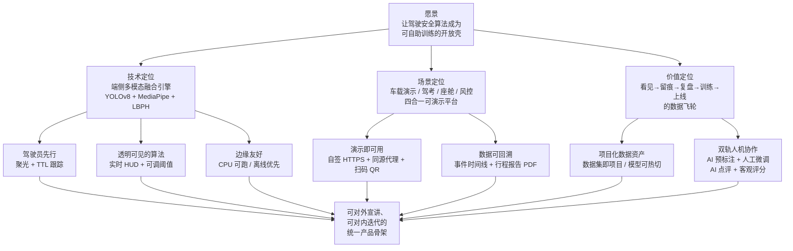
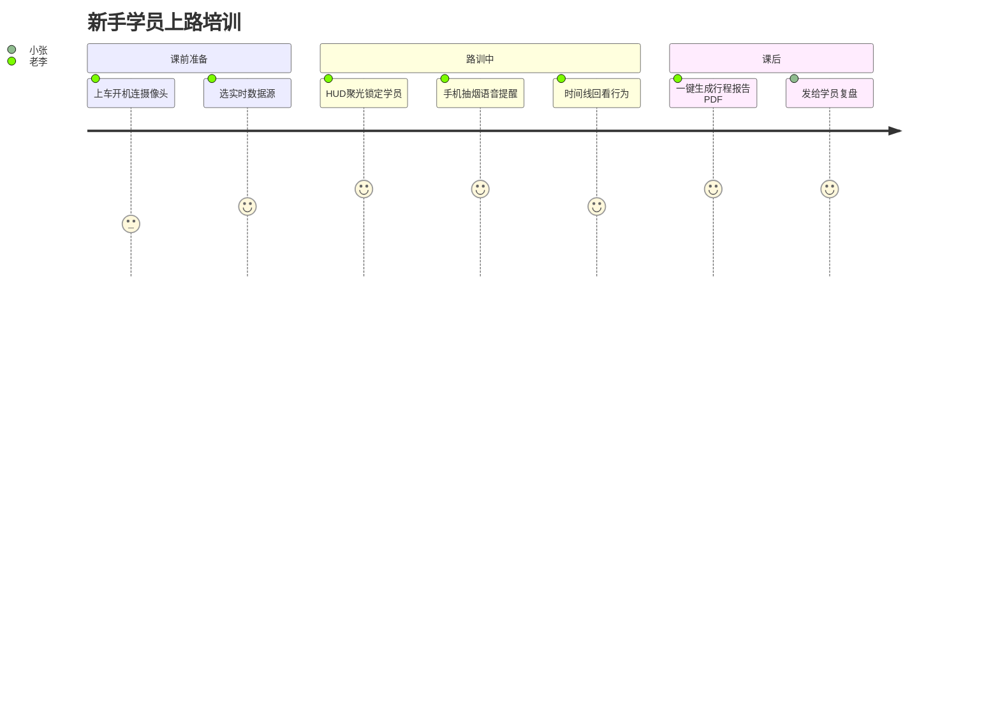
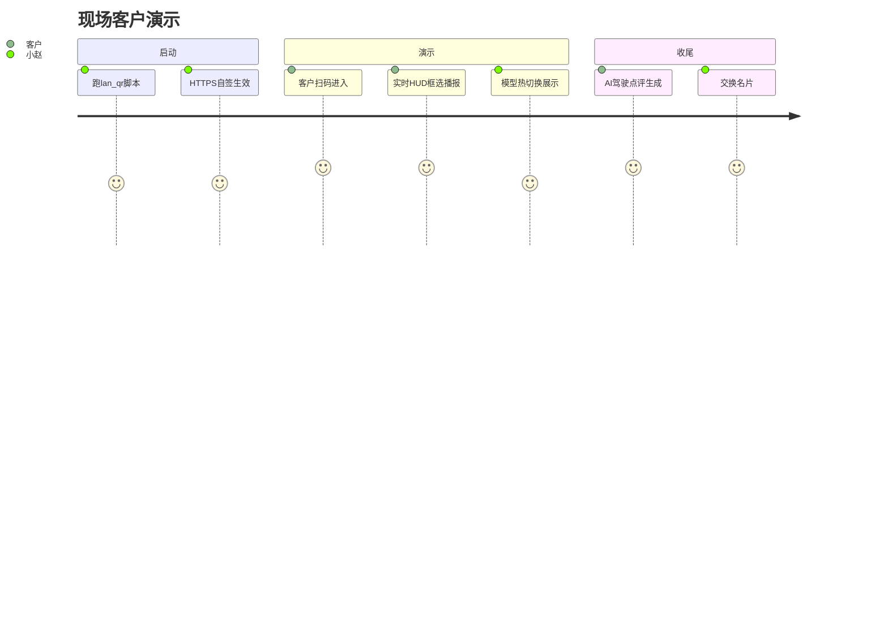
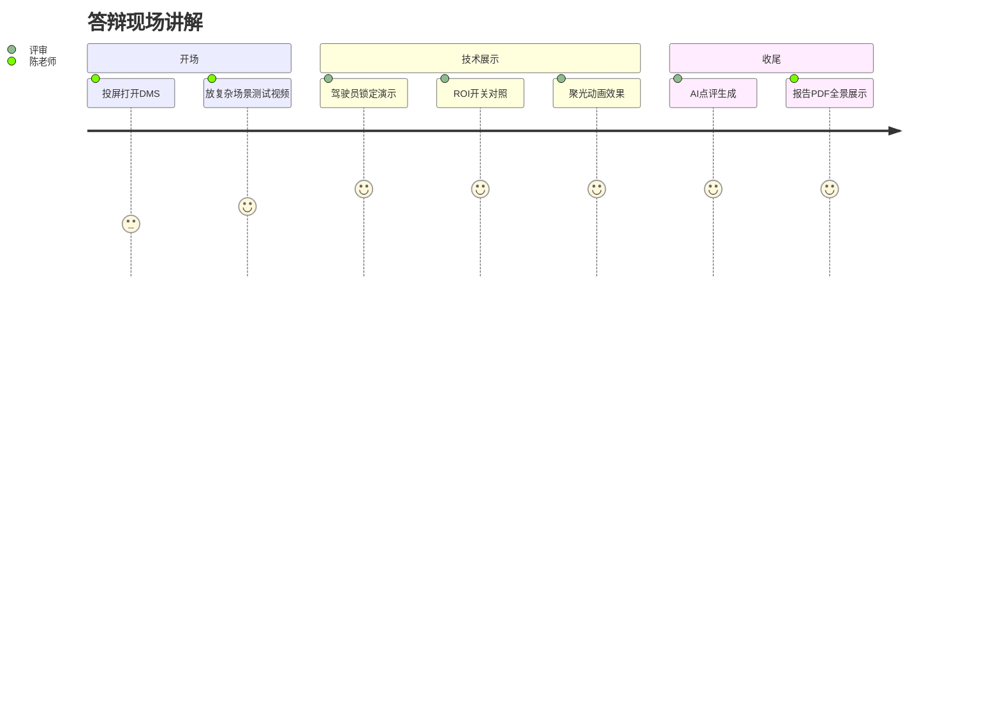
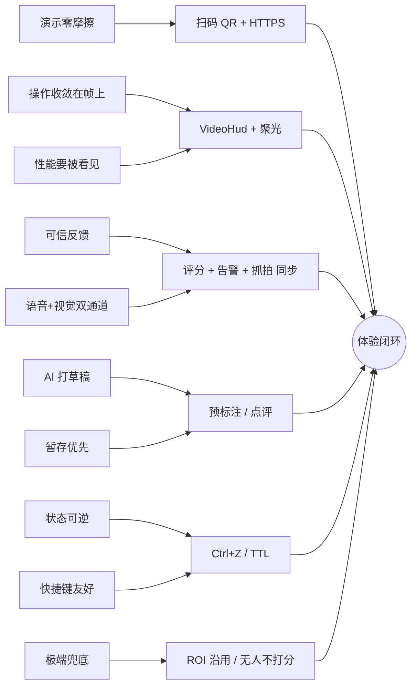
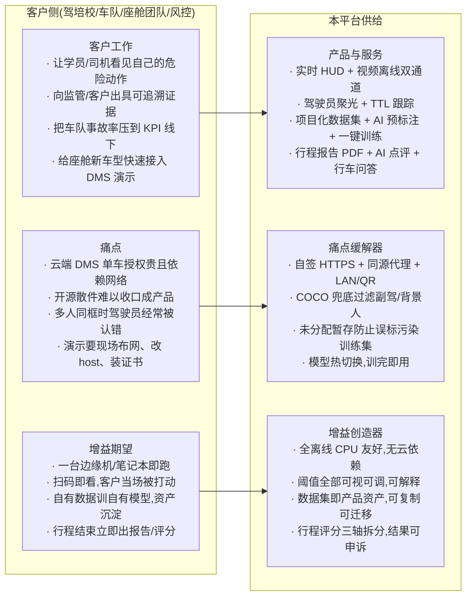
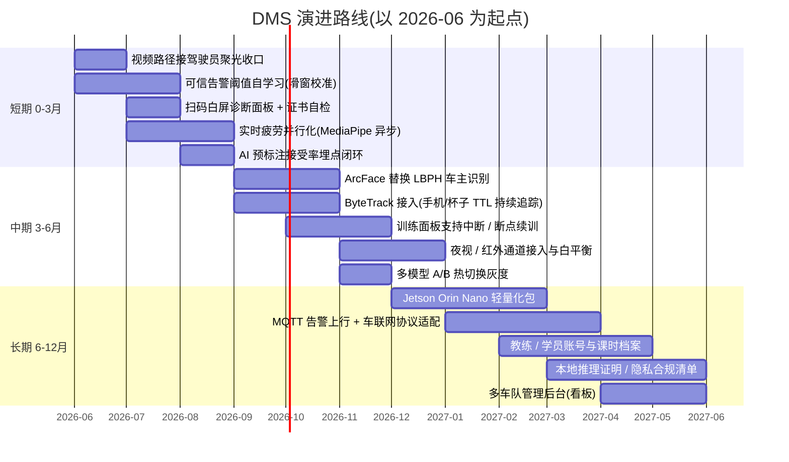

# DMS 平台 — 产品功能设计文档

## 文档说明

本文档面向**产品经理、交互设计师、解决方案与售前、教研与运营人员、合作客户的关键决策者**,以及希望从"用户与体验"视角理解 DMS 平台的算法与工程团队成员。它回答的是"这套系统**为什么这么做、为谁而做、做到什么程度算好**"——而不是"它内部是怎么实现的"。

与 `docs/系统设计.md` 相对照:系统设计文档讲架构、模块边界、数据流、推理链路、热部署机制等**技术骨架**;本文档讲产品定位、用户画像、使用旅程、信息架构、交互原则、差异化主张、指标与路线图等**产品骨架**。两份文档共享同一套术语(详见附录 A),互为镜像:技术设计的每一条决策,都对应着这里某一条产品理念;而本文档提出的每一项体验承诺,也都能在技术设计里找到落点。

一句话定义:**DMS 是一套面向真实驾驶场景、可在普通 PC / 边缘机上闭环跑通的"驾驶员状态推演与行为测算"平台**,以驾驶员为中心,把可见的危险动作、难量化的疲劳趋势、难复盘的行车过程,统一沉淀为可被人理解、可被算法持续优化的数据资产。技术栈一句话提示:**YOLOv8 unified.pt(7 类危险动作)+ COCO yolov8s 兜底 + MediaPipe FaceLandmarker(疲劳)+ OpenCV LBPH(车主识别)+ TTL 跟踪与混合定位 + FastAPI/React 同源代理 + 自签 HTTPS + 局域网 QR 扫码 + DashScope/Qwen(可选 AI 点评)**。

## 目录

1. 产品定位与设计理念
2. 用户画像
3. 使用场景与用户旅程
4. 信息架构与功能矩阵
5. 交互与体验设计原则
6. 差异化与价值主张
7. 评估指标 · 演进路线 · 风险
8. 总结
- 附录 A:术语表
- 附录 B:相关文档

---

## 1. 产品定位与设计理念

### 1.1 一句话定位

DMS 是一套**面向真实驾驶场景、可在普通 PC 上闭环跑通的"驾驶员状态推演与行为测算"平台**——以驾驶员为中心,把"看得见的危险动作"、"摸不准的疲劳趋势"和"难以复盘的行车过程"统一沉淀为可被人理解、可被算法持续优化的数据资产。

### 1.2 三层定位

| 定位维度 | 描述 | 关键载体 |
| --- | --- | --- |
| 技术定位 | 端侧多模态融合的驾驶员行为/状态识别引擎 | YOLOv8 unified.pt(7 类危险动作) + COCO yolov8s 兜底 + MediaPipe FaceLandmarker(疲劳) + OpenCV LBPH(车主识别) + TTL 跟踪与混合驾驶员锁定 |
| 场景定位 | 车载演示、驾考培训、智能座舱预研、安全风控复盘的"四合一"可演示平台 | 实时摄像头流 + 上传视频两条分析路径,统一的事件时间线与行程报告 |
| 价值定位 | 把"驾驶安全"从一次性硬件功能升级为**可训练、可回溯、可二次开发**的项目化资产 | 多数据集/多模型项目化(注册→预标注→人工微调→训练→热部署),AI 驾驶点评 + 行车问答 |

技术上,我们刻意不追逐"最大最重"的模型,而是把 unified.pt 这一类 7 类小模型 + MediaPipe 关键点 + 经典 CV(Haar/LBPH)拼接成**能在 CPU 上跑、能在边缘落地、能在演示现场即点即看**的栈;场景上,我们把"实时识别 / 视频复盘 / 数据训练 / AI 点评"四个原本割裂的环节合到一个工程模板里;价值上,我们交付的不是单点检测,而是一整套"看见 → 留痕 → 复盘 → 训练 → 再上线"的飞轮。

### 1.3 产品愿景

我们相信,真正能改变驾驶安全的,不是一颗更强的芯片,也不是一次性的硬件功能,而是**让算法能力像水电一样,可被一线教练、车队管理者、座舱开发者自己组装和迭代**。DMS 希望把曾经被锁在云端 API 和黑盒 SDK 里的能力,还原成**一个可以双击启动、扫码即用、训完即热部署**的开放壳。

在三年的尺度上,我们希望 DMS 成为**驾驶领域的"可自助训练的 DMS 操作系统"**:任何一个驾校、任何一支车队、任何一家 Tier-1 都能基于这套模板,在不连云的前提下,用自己的真实数据,训练出贴合自己业务的驾驶员行为模型,并在同一界面里完成评分、点评、复盘和报告输出。

### 1.4 设计理念与产品原则

我们坚持以下 7 条原则,任何功能改动都必须能被映射回其中至少一条;违背任意一条的需求,默认会被拒绝。

**1) 驾驶员先行(Driver-First)**
所有判断都围绕"画面里那个被锁定的驾驶员",而不是"画面里所有的人"。背景行人、副驾乘客、窗外路人会被天然排除在评分和告警之外。
- 落地体现:**驾驶员聚光(Driver Spotlight)** + 混合定位策略 + TTL 跟踪——一旦锁定,即使 YOLO 偶尔丢框,也能在 N 帧内维持身份,不至于让"驾驶位无人"在抖动里反复跳。

**2) 透明可见的算法(Glass-Box,不做黑盒)**
任何会影响告警和评分的阈值、置信度、状态量,都要在前端有可见的呈现位,而不是埋在配置文件里。
- 落地体现:**实时 HUD** 上同时显示 7 类行为的置信度、PERCLOS 闭眼比例、视线偏离角度、当前锁定的驾驶员 ID;阈值在控制面板里可拖拽,改动即时生效。

**3) 演示即可用(Demo-Ready by Default)**
能不能在陌生网络、陌生电脑、陌生人手里,30 秒内跑起来,是产品成熟度的硬指标。
- 落地体现:一键起服务脚本 + **自签 HTTPS** + **局域网同源代理** + **扫码 QR**(`scripts/lan_qr.py`)。访客手机扫码即同源进入实时页面,不需要改 hosts、不需要装证书向导。

**4) 项目化数据资产(Dataset-as-Project)**
数据集不是一堆散乱的图片,而是一个**有注册名、有版本、有归属模型**的"项目"。每个任务都对应一组可训、可切、可回滚的模型权重。
- 落地体现:数据集注册 → 上传/视频切帧 → **AI 预标注** → 人工微调 → **未分配暂存** → 自动 train/val 划分 → 训练 → **模型热部署/切换**,全流程在一个页面里完成;`behavior_algo/models/` 下 unified / realtime / video 三套权重可独立切换。

**5) 边缘友好(Edge-Friendly,Offline-First)**
默认不依赖云推理。一台普通 i5 笔记本就能跑完整闭环——这不是性能炫技,而是为了能真正进到没有公网的车间、考场、车队仓库里。
- 落地体现:YOLOv8s 量级模型 + MediaPipe CPU 后端;只有"AI 驾驶点评 / 行车问答"这一非实时增值层走 DashScope/Qwen,核心识别链路即使断网也照常工作。

**6) 双轨人机协作(AI-in-the-Loop,人始终在闭环)**
AI 不替代人,而是**把人的工作量从"从零开始"压到"只改错的那一部分"**。无论是标注还是点评,都是 AI 先出草稿、人来定稿。
- 落地体现:数据侧——AI 预标注 → 人工微调;评估侧——客观分(行为分 / 疲劳分 / 综合分)+ **AI 驾驶点评**与**行车问答**双轨呈现,教练既看得见硬指标,也读得到自然语言建议。

**7) 数据可回溯(Every Event Is Reproducible)**
每一次告警都必须能被找回:什么时候、什么动作、什么置信度、当时画面长什么样、整段行程评分如何。
- 落地体现:**事件时间线** + 抓拍画廊 + **行程报告 PDF**(一键打印),既是给驾驶员的复盘材料,也是给管理方的证据链。

### 1.5 设计取舍与边界

产品的清晰度,一半来自做了什么,另一半来自**明确不做什么**。以下是我们当前阶段刻意不进入的领域:

| 不做 | 原因 | 替代路径 |
| --- | --- | --- |
| 云端转推 / 视频上云存储 | 与"边缘友好、离线可跑、隐私优先"原则冲突;一旦走云,部署门槛和合规成本立即翻倍 | 行程报告 PDF + 本地抓拍画廊,需要分享时由用户自主导出 |
| 账号体系 / 多租户权限 | 当前定位是单机/单车/单工位的演示与训练壳,引入账号会把"扫码即用"破坏掉 | 以"项目(数据集)"为隔离粒度,谁打开工程就拥有完整权限 |
| 车联网 / CAN 总线对接 | 不同车厂协议碎片化严重,贸然对接会让代码绑死在某一款车上 | 留出标准化事件 JSON 输出,由集成方按需桥接到自己的 T-Box |
| 多摄像头融合(环视 / DMS+OMS) | 当前 7 类行为 + 疲劳已能覆盖座舱内 80% 风险;过早多路融合会牺牲实时性 | 架构上预留多 source 入口,但默认单驾驶员摄像头 |
| 端到端大模型直接出告警 | 大模型延迟与算力门槛与"CPU 实时"冲突,且不可解释 | 大模型只用于事后点评与问答,不进入实时告警链路 |
| 自研标注工具的完整替代品 | 不与 CVAT/Label Studio 竞争 | 内置最小够用的标注+AI 预标注,导入导出走通用 YOLO 格式 |

这些边界不是永久的,而是**当前阶段的能量分配选择**——把有限的工程精力压在"驾驶员先行 + 边缘闭环 + 数据飞轮"这条主轴上。

### 1.6 愿景—定位—原则总览

这张图的读法很简单:**愿景定方向,三层定位划出战场,7 条原则把"我们到底为什么这样做"钉死在每一个具体功能里**。当后续章节展开"实时 HUD 为什么这样布局"、"数据集为什么必须先注册再上传"、"为什么扫码进来要走同源代理"时,所有回答都能追溯到本章的某一条原则,而不是临时拍脑袋的产品偏好。

→ 与系统设计文档的对应章节:参见 `docs/系统设计.md` 第 1 章"系统总览与目标"以及第 2 章"架构原则",其中的技术取舍均与本章 7 条产品原则一一对应。

---

定位与原则讲清楚了"我们为何而做",但产品最终要被某一个具体的人按住鼠标用起来。下一章把抽象的"驾驶员先行"落到 5 个有名有姓的画像上——他们各自一天里如何遇见 DMS、又会因为哪一条不满意而立刻关掉浏览器。

## 2. 用户画像

本平台不是一个"通用 AI 视觉 SDK",而是要在每一个真实场景里被人按住鼠标用起来:教练要在学员车里复盘动作、算法工程师要在工位上调阈值跑批、车队主任要在月底打开报表追责、高校老师要在投影仪前讲清楚每一帧发生了什么、方案经理要在客户会议室扫码两秒钟出画面。下面用 5 个画像把"我们到底在替谁省事"讲明白,并在末尾给出画像-功能映射表,作为后续需求优先级排序的依据。

### 2.1 赵教练 —— 驾校 C1 培训教练

**基本信息**:42 岁,某市机动车驾驶员培训学校科目二/科目三教练,带车 11 年。技术水平偏低,日常只用微信、抖音和驾校的排课小程序,不会 Linux,不会改配置文件,但能熟练操作手机和平板。工作环境是教练车副驾,夏天 38℃ 太阳直射,车内有教学终端(平板) + 一颗朝向驾驶位的摄像头。

**典型一天**:早上 6 点半到训练场,带 3 个学员各跑两小时。每个学员上车前,他在平板上点"开始本次训练",平台进入实时分析模式;学员手扶方向盘起步、并线、倒库,赵教练眼睛盯路面,余光瞄一下平板右上角的实时 HUD —— 一旦看到红色"双手离盘"或"使用手机"弹出,他马上口头纠正。下车后,他点"结束本次训练",平台直接生成行程报告 PDF,他截图发到学员家长群,顺手按一键打印 PDF 留档。

**核心目标**:
1. 在不打断教学节奏的前提下,客观记录学员的所有危险动作,避免"我说他他不认账";
2. 给每个学员留下一份带时间戳、带抓拍画廊的回放材料,便于补课;
3. 把"专注度"量化成行为分,作为下一次课的重点纠正项;
4. 设备开机 30 秒内能用,不需要找网管。

**核心痛点**:
1. 以前用行车记录仪事后翻录像,1 小时课要倒半小时,根本看不完;
2. 学员当场不承认"我没玩手机",空口无凭;
3. 高温下平板会黑屏/卡顿,跑得太慢的检测毫无意义。

**最常用模块**:实时分析(摄像头)、实时 HUD 与告警语音、抓拍画廊、行程报告 PDF、扫码 QR(平板有时连不上网,直接扫教练车热点访问)。

**判定标准**:开机即用、检测延迟低于半秒、报告能直接发家长群、不需要他懂"YOLO 是什么"。

### 2.2 林研究员 —— 智能座舱算法工程师

**基本信息**:29 岁,某 Tier1 智能座舱预研团队算法工程师,硕士计算机视觉方向。技术水平高,日常 Python + PyTorch + Linux,熟悉 YOLO 系列、MediaPipe、ONNX。工作环境是工位双显示器,域控开发板插在桌下,旁边一台 USB 摄像头模拟车内视角。

**典型一天**:上午跑实验,下午开评审会。他要对比 unified.pt、realtime.pt、video.pt 三个模型在同一段路测视频上的差异。他在平台里切到项目化数据集页面,新建一个"驾驶位行为对比"项目,在视频分析里上传同一段 MP4,分别用模型切换跑三次,导出每帧延迟、行为命中、疲劳得分曲线对比。下午他在标注页用 AI 预标注把 800 张未分配暂存里的关键帧粗标一遍,只手工修 70 张边界框,然后点自动划分 + 训练,半小时拿到新模型热部署生效。

**核心目标**:
1. 在一个统一界面里横向对比多个模型,而不是切 N 个 Jupyter;
2. 所有阈值(PERCLOS、视线偏离角度、TTL、置信度)都暴露成可调滑杆,改完立刻看到效果;
3. 用 AI 预标注把人工标注量压到 10% 以内;
4. 训练 → 部署 → 再验证 形成闭环,不需要重启服务。

**核心痛点**:
1. 别家 demo 把模型/阈值写死在代码里,改一次要重编译;
2. 数据集散落在不同盘,版本混乱,训完不知道用的哪一批;
3. 边缘 CPU 上跑不起来的炫技模型,对他无用。

**最常用模块**:项目化数据集、AI 预标注、标注微调、训练任务、模型切换、视频分析、实时 HUD(看每帧 ms/score)、阈值面板。

**判定标准**:能从原始视频一路走到上线模型不离开浏览器;能把对比结果直接截图贴进周会 PPT;CPU 下 unified.pt 实时不低于 15 fps。

### 2.3 王车队主任 —— 物流车队安全风控

**基本信息**:48 岁,华东某冷链物流公司车队安全主任,管 120 辆中重卡。技术水平中等,会用 Excel 透视表、能看懂折线图,但不写代码。工作环境是车队调度中心,一面墙四块屏,办公室常驻;偶尔下到车场抽查车载终端。

**典型一天**:早上 8 点到岗,第一件事是看昨晚跨夜班司机的疲劳事件汇总。他在平台里按司机筛选行程报告,重点看 PERCLOS 超阈值、打哈欠次数、低头时长,把疲劳分低于 60 的司机挑出来,导出 PDF 报告 给到 HR 谈话。中午有个司机被举报"开车刷短视频",他调出当天那一段视频分析,在事件时间线上直接定位到"使用手机"红事件,抓拍画廊里两张清晰证据,作为处罚依据。下午他给新来的 5 个司机做驾驶员登记,LBPH 录入人脸,以后这些人上车自动识别。

**核心目标**:
1. 把"司机是否疲劳/玩手机"从主观投诉变成可追溯的客观数据;
2. 每月按司机出一份可对比的行为分/疲劳分排行;
3. 抓拍证据必须清晰、带时间戳,能直接用于内部处罚;
4. 一台中控机管所有车,不要每辆车装一套不一样的东西。

**核心痛点**:
1. 现有方案要么云端推理(冷链车信号不稳)、要么只报警不留证;
2. 报告导不出,只能截图,法务不认;
3. 驾驶员换班频繁,系统不知道是谁在开,事件挂不到人头上。

**最常用模块**:视频分析(回溯)、实时分析(直播抽查)、驾驶员登记(LBPH 人脸)、驾驶员聚光(从副驾/装卸工里锁定真正司机)、事件时间线、抓拍画廊、行程报告 PDF、AI 驾驶点评。

**判定标准**:一次事件从"听说"到"定位证据"不超过 1 分钟;报告能直接进 OA 走流程;系统自己分得清司机和副驾。

### 2.4 苏老师 —— 高校研究生导师 / 课程示范

**基本信息**:36 岁,某 985 高校交通信息工程副教授,带研究生方向是驾驶行为与人因。技术水平高,但更偏教学表达,关心"能不能给学生讲清楚"。工作环境是阶梯教室 + 实验室,投影仪 + 自己笔记本 + 一颗 USB 摄像头。

**典型一天**:周三下午 2 点《智能车辆感知》课,讲"驾驶员状态监测"。她在课前 10 分钟用扫码 QR + 自签 HTTPS 把同学手机也接到她笔记本起的服务上,大家手机扫码就能围观实时 HUD。讲到 PERCLOS 时,她现场拉低阈值,让学生看到自己稍微眯眼就触发"疲劳";讲到检测原理时,她切到视频分析,逐帧暂停,展示 YOLO 框 + COCO 兜底 + 驾驶员聚光的层级关系,用 TTL 跟踪解释为什么框不会闪烁。课后,她把这段课堂演示视频和行程报告 PDF 发到课程群作为作业素材。

**核心目标**:
1. 现场不出故障 —— 投影、网络、摄像头任何一项掉链子都尴尬;
2. 每一个出现在屏幕上的数字都能被解释(置信度、TTL、PERCLOS、行为分);
3. 学生不用装客户端,扫码即看;
4. 能把演示沉淀成可复用的教学材料。

**核心痛点**:
1. 现成 demo 是黑盒,看不到中间变量,讲不下去;
2. 教室 Wi-Fi 不让连外网,云推理直接没戏;
3. HTTPS 浏览器告警让学生不敢扫。

**最常用模块**:实时分析、阈值面板(全部可见可调)、视频分析逐帧、扫码 QR、自签 HTTPS、驾驶员聚光可视化、行程报告 PDF、AI 驾驶点评(用作课堂讨论引子)。

**判定标准**:整堂课无一次重启;每个参数学生当堂能问出"为什么是这个值";离线纯局域网可跑。

### 2.5 小陈 —— 产品 / 方案经理

**基本信息**:31 岁,主机厂智能化解决方案部售前方案经理。技术水平中等偏上,看得懂架构图、能跑命令但不写算法。工作环境是出差路上 + 客户会议室 + 酒店,主力设备是一台轻薄本和一根 4G 随身 Wi-Fi。

**典型一天**:周二早上飞重庆见客户,11 点到会议室,客户给 20 分钟讲方案。他打开笔记本,启动平台,屏幕上弹出扫码 QR,客户技术负责人用手机扫码,3 秒后看到自己脸出现在实时 HUD 上,行为检测、疲劳分实时跳动 —— 第一印象拿下。接下来他播放一段事先准备好的高难度路测视频走视频分析,生成行程报告 PDF,当场打印两份留给客户。会后他在酒店打开项目管理,新建一个以这家客户命名的项目模板,把今天演示的数据集和模型留作下次复访素材。

**核心目标**:
1. 从开机到客户看到画面不超过 1 分钟;
2. 报告颜值高、能直接进标书附件;
3. 一个项目模板可水平复制,下次见别的客户改个名字就能用;
4. 不依赖外网 —— 客户会议室常常无网或要走访客 Wi-Fi。

**核心痛点**:
1. 客户会议室设备五花八门,投屏+网络永远有意外;
2. 自己不是算法,被客户追问参数时答不上来,需要界面替他答;
3. 报告丑、截图糊,等于白演示。

**最常用模块**:扫码 QR、自签 HTTPS、实时分析(开场)、视频分析(拿手戏)、AI 驾驶点评(锦上添花)、行程报告 PDF 一键打印、项目化数据集(沉淀客户素材)、模型切换(按客户行业切到对应权重)。

**判定标准**:任何一台陌生 Windows 笔记本 5 分钟能搭起来;PDF 不用美工二次加工;离线 4G 也能演。

### 2.6 画像 - 功能映射表

下表给出 5 个画像对平台主要功能模块的使用强度,作为后续 Roadmap 与默认设置(谁的体验先被照顾)的优先级依据。★★★ = 该角色的核心高频功能,产品必须把它做到极致;★★ = 常用、关键路径;★ = 偶尔用到、有就行;-  = 与该角色基本无关。

| 功能模块 \ 画像 | 赵教练 | 林研究员 | 王车队主任 | 苏老师 | 小陈 |
| --- | --- | --- | --- | --- | --- |
| 实时分析(摄像头 + HUD) | ★★★ | ★★ | ★★ | ★★★ | ★★★ |
| 视频分析(上传回溯) | ★★ | ★★★ | ★★★ | ★★★ | ★★★ |
| 标注(AI 预标注 + 微调) | - | ★★★ | - | ★ | - |
| 训练任务(自动划分+热部署) | - | ★★★ | - | ★ | - |
| 模型切换(unified/realtime/video) | ★ | ★★★ | ★★ | ★★ | ★★ |
| 项目化数据集管理 | ★ | ★★★ | ★★ | ★★ | ★★★ |
| AI 驾驶点评 + 行车问答 | ★★ | ★ | ★★ | ★★ | ★★★ |
| 行程报告 PDF / 一键打印 | ★★★ | ★ | ★★★ | ★★ | ★★★ |
| 驾驶员登记(LBPH)+ 聚光 | ★ | ★ | ★★★ | ★★ | ★ |
| 扫码 QR / 自签 HTTPS 演示 | ★★ | - | ★ | ★★★ | ★★★ |
| 阈值面板(PERCLOS/TTL/置信度) | - | ★★★ | ★ | ★★★ | ★ |
| 抓拍画廊 + 事件时间线 | ★★★ | ★ | ★★★ | ★★ | ★★ |

从映射表能直接读出三条产品策略:
- **行程报告 PDF + 实时 HUD** 是横跨 5 个画像都高强度使用的"主路径",必须默认即开箱可用,不应被任何配置门槛拦住;
- **标注/训练/阈值面板** 是林研究员与苏老师的核心,但对赵教练、王车队、小陈几乎无关 —— 应做成"高级模式"折叠,默认不打扰非技术用户;
- **扫码 QR + 自签 HTTPS** 是小陈和苏老师的生死线,对林研究员意义不大 —— 但因为它直接决定"客户/学生能不能 3 秒看到画面",必须作为出厂默认开启项,而不是藏在文档第 7 页。

→ 与系统设计文档的对应章节:参见 `docs/系统设计.md` 第 3 章"角色与权限"、第 4 章"部署形态"——画像驱动的功能优先级直接决定了哪些路径必须默认开启、哪些可以放进高级折叠区。

---

5 个画像各自的"典型一天"已经把 DMS 嵌入了真实工位,但这些一天并非孤立的剪影——把它们拉直,就是 5 条可被走通的产品路径。下一章把每条路径拆成"触发点 / 关键步骤 / 期望结果 / 失败兜底 / 心情曲线",并在末尾汇成一张主干旅程图。

## 3. 使用场景与用户旅程

驾驶状态推演与行为测算(DMS)平台的功能集合并非"实验室里的算法清单",而是被组织成一条条可被真实角色走通的产品路径。本章围绕教练、风控、方案经理、算法工程师、高校教师 5 类典型角色,刻画他们如何借助平台从"点开"走到"拿到结果",并把途中可能踩的坑、平台给出的兜底路径一并展开,最后用一张主干流程图把所有场景串成"扫码 → 登录 → 选项目 → 标注/训练/分析 → 报告 → 分享"的完整闭环。

### 3.1 场景 A:新手学员上路培训

**情境一句话**:教练老李在驾校教练车副驾位置,使用平板打开 DMS 实时分析页,实时盯一名学员小张 30 分钟桩外路训。

**触发点**:教练车启动、点火、点亮平板,教练在 ControlPanel 选择"实时摄像头",挂载车内 USB 摄像头流到后端推理管线。教练并不关心模型版本,他要的是"小张一手机、一抽烟,画面里立刻能看见框 + 听见语音"。

**关键步骤**:
- 在控制面板切换数据源为实时流,后端 `/api/stream` 拉起 unified.pt(7 类危险动作模型)做帧级推理,COCO yolov8s 兜底用于驾驶员人形锚定;
- 视频 HUD 叠加"驾驶员聚光"效果,非驾驶员区域降亮,副驾乘客即便举着手机也不会触发误报;
- 当小张接电话超过 TTL 窗口,画面上"手机"框稳定亮起、AnimatedBoxes 做呼吸动画,扬声器播放对应行为的语音提醒("请勿在驾驶中使用手机");
- 教练点开右侧"事件时间线",逐条回看小张过去 30 分钟里的"双手离盘 2 次 / 视线偏离 5 次 / 打哈欠 1 次";
- 训练结束,教练点"生成行程报告",平台聚合行为分 + 疲劳分 + 综合分,导出可一键打印的行程报告 PDF,交给学员复盘。

**期望结果**:教练拿到一份带时间戳、抓拍画廊、综合分的 PDF,可发给学员家长或留档;30 分钟内零手动操作,仅在结束时点一次"生成报告"。

**失败/兜底路径**:若摄像头掉线,HUD 显示"无视频流"占位卡片而非黑屏;若驾驶员暂时被遮挡,驾驶员锁定走"杂框→COCO 人形确认"两段式而非直接报"驾驶位无人",避免误报扣分。

**心情曲线**:上车前略焦虑(怕设备不亮)→打开即出画面,安心→中段发现行为捕捉精准,认可→训练结束 PDF 一键到手,满足。

### 3.2 场景 B:车队司机周抽检

**情境一句话**:物流公司风控员王姐在办公室,每周一抽 3 段行车记录仪视频上传到平台,给重点关注司机打"周安全分"。

**触发点**:周一上午,王姐从行车记录仪后台导出 mp4,进入"上传视频"路径,把 3 段约 20 分钟的素材依次拖入。

**关键步骤**:
- 选择项目化数据集中"长途货运"项目,自动绑定该项目下生效的 unified.pt 与对应阈值(疲劳 PERCLOS 阈值、视线偏离角度);
- 上传任务异步执行,前端进度条 + 后端 driver_id 模块对每一段视频先做驾驶员锁定,再走 7 类行为 + 疲劳四联检(打哈欠/视线/PERCLOS/低头);
- 跑完后视频被切成事件级片段,进入"事件时间线",王姐重点看红色高危事件(手机、双手离盘);
- 每个事件可点开看抓拍画廊里的代表帧,左上角带置信度与时间码;
- 王姐选择"生成行程报告",三段合并为一份周报 PDF,封面标注综合分与同比变化。

**期望结果**:单段 20 分钟视频在 CPU 边缘机上 5~8 分钟跑完,王姐 30 分钟内出完整周报,关键事件可定位到秒。

**失败/兜底路径**:若视频编码异常,平台返回明确错误码而非默默挂起;若驾驶员锁定失败(夜间过暗),平台仍输出"已检测但无法稳定锁定驾驶员"的提示,避免把杂框当主驾驶强行打分。

**心情曲线**:上传时略不耐(怕慢)→进度条稳定推进,放心→事件时间线一目了然,专业感拉满→周报 PDF 直接发风控群,省时。

### 3.3 场景 C:现场客户演示

**情境一句话**:方案经理小赵带笔记本到客户公司会议室,现场给采购演示 DMS。

**触发点**:客户问"能不能现在就看?"小赵打开笔记本,运行 `scripts/lan_qr.py`,屏幕上立刻弹出局域网二维码。

**关键步骤**:
- 笔记本启动自签 HTTPS + 局域网同源代理,前后端共用一个 origin,避免移动端因混合内容被浏览器拦;
- 客户用手机扫码 QR,直接在自己手机上打开 DMS 前端,无需装 App、无需配 IP;
- 小赵切到"实时分析",调用客户会议室桌面的 USB 摄像头(或自带车规摄像头模组),让客户拿出手机演"开车看手机",HUD 立刻框选+语音播报;
- 切到 ModelDataPage,展示数据集 / 模型项目化能力,告诉客户"同一台机器可以挂多个项目,模型可热切换";
- 演示结束,小赵切到"AI 驾驶点评",让 Qwen 基于刚才 2 分钟的事件流生成一段自然语言总结。

**期望结果**:客户全程在自己手机上看到结果,"无需安装、扫码即用、本地推理不上云"三条卖点被验证完毕。

**失败/兜底路径**:会议室 Wi-Fi 隔离了客户端互通时,小赵回退到"笔记本热点 + 二维码"模式;自签证书首次拦截时,客户端点"高级 → 继续访问"即可。

**心情曲线**:开场前忐忑(怕掉链子)→扫码秒进,松一口气→实时框选+语音命中,气氛热起来→AI 点评收尾,专业印象稳了。

### 3.4 场景 D:新行为类别冷启动

**情境一句话**:算法工程师阿凯接到需求:"加一类'整理头发'行为",他要在一周内从零跑通。

**触发点**:周一晨会拍板,阿凯在 ModelDataPage 点"新建项目",输入名字"hair_v1",模板复制一份空数据集。

**关键步骤**:
- 上传 6 段含目标动作的内部视频,平台按固定步长切帧,结果落入"未分配暂存"区;
- 在暂存区点"AI 预标注",由当前生效的 unified.pt + 自定义提示规则给候选框打初标,阿凯只做"接受/拒绝/微调"动作而非从零拉框;
- 边标注边触发"自动划分",按 8:1:1 落入 train/val/test 三个子目录;
- 点"开始训练",后端拉起 YOLOv8 训练脚本,前端进度条显示 epoch/loss/mAP;
- 训练完产物落到 `behavior_algo/models/hair_v1.pt`,在模型管理面板点"切换生效",实时管线热加载新权重;
- 走一段验证视频,确认新类别在 HUD 中能稳定框选、未引起旧类别回退。

**期望结果**:一周内闭环,新类别上线无需重启服务,"未分配暂存 → AI 预标注 → 人工微调 → 自动划分 → 训练 → 热切"全在 Web UI 完成。

**失败/兜底路径**:训练 mAP 不达预期时,回退到上一版生效模型(模型版本表保留指针);AI 预标注全错时,可整批拒绝并切回纯人工标注模式。

**心情曲线**:接需求时压力大→预标注省 70% 体力,情绪稳→训练进度可见,踏实→热切生效不掉服务,成就感。

### 3.5 场景 E:答辩现场讲解

**情境一句话**:高校陈老师带学生在校内报告厅,向评审组展示这套系统的技术亮点与工程完整度。

**触发点**:答辩时间到,陈老师投屏笔记本,浏览器打开本地 DMS。

**关键步骤**:
- 先放一段预存的"复杂车内"测试视频(主驾 + 副驾 + 后排),让评审看到驾驶员锁定如何从多人画面中只圈中主驾;
- 切换 ROI 收口开关,演示"开/关 ROI"对副驾误检的对照差异;
- 打开驾驶员聚光特效,非主驾区域降亮,框 + 呼吸动画聚焦在驾驶员身上,讲解 AnimatedBoxes 实现思路;
- 切到 AI 驾驶点评,基于刚才视频生成一段中文自然语言评语,评审看到"算法 + LLM"组合效果;
- 最后展示行程报告 PDF,把综合分、行为分、疲劳分、事件时间线、抓拍画廊一次性呈现。

**期望结果**:评审在 8 分钟内完整看到"检测 → 锁定 → 点评 → 报告"四级递进,不需要陈老师手忙脚乱切窗口。

**失败/兜底路径**:现场投屏分辨率异常时,前端布局保持响应式不挤压关键 HUD;若实时摄像头不可用,直接回退到预上传视频路径。

**心情曲线**:候场紧张→聚光特效一上,评审探身,自信→AI 点评出彩,气氛热→报告 PDF 收尾,稳稳落地。

### 3.6 场景对比速览

| 场景 | 主角色 | 主路径 | 核心功能依赖 | 输出物 |
| --- | --- | --- | --- | --- |
| A 新手培训 | 教练 | 实时流 | HUD + 聚光 + 语音 + 时间线 | 行程报告 PDF |
| B 周抽检 | 风控员 | 上传视频 | 项目化数据集 + 事件切片 + 画廊 | 周报 PDF |
| C 客户演示 | 方案经理 | 实时流 + 扫码 | 自签 HTTPS + 局域网代理 + QR | 名片 + 复访 |
| D 冷启动 | 算法工程师 | 数据→模型 | 暂存区 + AI 预标注 + 热切 | 新版 .pt |
| E 答辩 | 高校教师 | 视频回放 | 驾驶员锁定 + ROI + 聚光 + AI 点评 | 评审通过 |

### 3.7 核心用户旅程图

把 5 个场景的共性主干抽出来,得到一条"从二维码到分享"的统一旅程:扫码或本地启动进入系统、按角色登录(演示场景可游客)、选择或新建项目、根据角色分别进入标注/训练或实时/视频分析、生成行程报告、最终向上游或下游分发。

这条主干隐含一个产品哲学:**任何角色在任何场景下,都能在不超过 5 步内拿到一份可分享的结果**。无论是教练的 30 分钟训练总结、风控的周抽检周报、方案经理的客户现场感、算法工程师的新模型上线,还是高校老师的答辩展示,最终都收束到"项目 + 报告"这对核心实体上,从而保证产品迭代有统一的衡量尺度——每一个新功能都要回答一个问题:它让谁的旅程更短了?

→ 与系统设计文档的对应章节:参见 `docs/系统设计.md` 第 5 章"端到端推理流水线"与第 6 章"实时通道与视频通道差异",场景 A、B、D 的关键步骤即对应技术文档里两条通道的入口与降级策略。

---

旅程把"用户怎么走"讲清楚了,但每一步都要落到屏幕上的某一块区域、某一个开关、某一个面板。下一章把这些散点收束成一份信息架构——一棵 6 个一级模块的导航树,以及一张覆盖全部二级功能的状态矩阵。

## 4. 信息架构与功能矩阵

本章描述 DMS 平台的整体信息架构(IA)、各模块二级功能、全局导航与状态可见性,以及配置层级的边界划分。整套架构围绕"一名驾驶员、一次行程、可观测、可调参、可复盘"的主线展开:无论入口在哪,用户都能在三步以内回到"当前驾驶员的实时状态"这一中心视图,所有数据加工(打标/训练)与运维操作(部署/证书/扫码)都被收拢到二级页面,不干扰主驾视场。

### 4.1 信息架构(IA)总览

DMS 平台采用扁平双层 + 模态浮层的结构。一级模块共 6 个:**实时分析、视频分析、数据集与模型、驾驶员管理、行程与报告、设置与部署**。其中"实时分析"是平台默认落地页,承担车载演示与日常监控两类高频任务;"视频分析"承载离线复盘与素材回灌;"数据集与模型"是工程师面向算法迭代的工作台;"驾驶员管理"管理人脸登记与权限;"行程与报告"沉淀历史复盘资产;"设置与部署"统一全局阈值、网络/证书、TTS 与 LLM 配置。

每个一级模块下设 3~6 个二级功能,二级功能再拆分到具体三级元素(开关、面板、模态框)。横向上,5 个全局元素(顶栏图标、左信息栏、右侧分数面板、HUD、告警语音)穿透所有模块,保证"主驾视图永远在场"。

```mermaid
graph TD
    Root[DMS 平台]

    Root --> M1[实时分析]
    Root --> M2[视频分析]
    Root --> M3[数据集与模型]
    Root --> M4[驾驶员管理]
    Root --> M5[行程与报告]
    Root --> M6[设置与部署]

    M1 --> M1a[摄像头流]
    M1 --> M1b[行为检测 7 类]
    M1 --> M1c[疲劳检测 4 项]
    M1 --> M1d[驾驶员聚光锁定]
    M1 --> M1e[实时 HUD]
    M1 --> M1f[告警 TTS 语音]
    M1a --> M1a1[设备选择/分辨率]
    M1b --> M1b1[手机/抽烟/饮水/进食/双手离盘/未系安全带/手在盘]
    M1c --> M1c1[哈欠/视线偏离/PERCLOS/低头]
    M1d --> M1d1[ROI 半透明遮罩]
    M1d --> M1d2[TTL 跟踪 ID]
    M1e --> M1e1[FPS/延迟/MODEL/锁定状态]

    M2 --> M2a[视频上传]
    M2 --> M2b[逐帧回放分析]
    M2 --> M2c[事件时间线]
    M2 --> M2d[无人/安全带/方向盘门控]
    M2 --> M2e[抓拍画廊]

    M3 --> M3a[项目注册]
    M3 --> M3b[原始素材上传/切帧]
    M3 --> M3c[AI 预标注]
    M3 --> M3d[人工微调标注]
    M3 --> M3e[自动 train/val 划分]
    M3 --> M3f[训练任务队列]
    M3 --> M3g[模型热部署切换]
    M3c --> M3c1[YOLO 预测框初始化]
    M3d --> M3d1[未分配暂存区]

    M4 --> M4a[车主人脸登记 LBPH]
    M4 --> M4b[识别置信度阈值]
    M4 --> M4c[驾驶员档案]
    M4 --> M4d[多人画面驾驶员定位]

    M5 --> M5a[行程评分 综合/行为/疲劳]
    M5 --> M5b[行程报告 PDF]
    M5 --> M5c[历史行程列表]
    M5 --> M5d[AI 驾驶点评]
    M5 --> M5e[行车问答 Qwen]

    M6 --> M6a[全局阈值面板]
    M6 --> M6b[模型项目切换]
    M6 --> M6c[局域网同源代理]
    M6 --> M6d[HTTPS 自签证书]
    M6 --> M6e[扫码 QR 接入]
    M6 --> M6f[DashScope Key 配置]
    M6 --> M6g[TTS 音色/音量]
```

### 4.2 功能矩阵表

下表列出全部二级功能,标注其所在模块、解决的痛点、关键交互与上线状态。状态分三档:**已上线**(可直接体验)、**优化中**(基础能力具备,精度/性能在迭代)、**规划**(下一里程碑)。

| 名称 | 所在模块 | 解决的痛点 | 关键交互 | 状态 |
|---|---|---|---|---|
| 摄像头流接入 | 实时分析 | 演示现场无需配置即可启动 | 顶栏相机图标一键开启,自动枚举设备 | 已上线 |
| 行为检测 7 类 | 实时分析 | 危险动作识别覆盖不足 | YOLOv8 unified.pt 实时框 + 类别名 | 已上线 |
| 疲劳检测(哈欠/视线/PERCLOS/低头) | 实时分析 | 仅靠行为漏掉嗜睡状态 | MediaPipe Landmarker,阈值面板可调 | 优化中 |
| 驾驶员聚光锁定 | 实时分析 | 副驾/后排误触发告警 | ROI 半透明遮罩 + TTL 跟踪 ID,丢失自动重锁 | 已上线 |
| 实时 HUD | 实时分析 | 不知道"现在到底在跑什么" | 左上角叠加 FPS / 延迟 / MODEL / 锁定状态 | 已上线 |
| 告警 TTS 语音 | 实时分析 | 视觉告警容易被忽略 | 各行为独立语音模板,可静音 | 已上线 |
| 视频上传分析 | 视频分析 | 现场无法复现的事故复盘 | 拖拽上传,逐帧推理,进度条 | 已上线 |
| 事件时间线 | 视频分析 | 长视频找事件低效 | 时间轴标记事件点,点击跳转 | 已上线 |
| 无人/安全带/方向盘门控 | 视频分析 | 仅在静态可信场景做硬判定 | 视频独有门控,实时模式不触发 | 已上线 |
| 抓拍画廊 | 视频分析 | 关键帧难以归档 | 每个告警自动留图,可下载 | 已上线 |
| 项目注册 | 数据集与模型 | 多场景/多车型数据互相污染 | 新建项目即新建数据集 + 模型槽位 | 已上线 |
| 原始素材切帧 | 数据集与模型 | 视频转图序列繁琐 | 上传视频按步长抽帧入库 | 已上线 |
| AI 预标注 | 数据集与模型 | 人工冷启动成本高 | 当前模型批量出框,人工只做增删改 | 已上线 |
| 人工微调标注 | 数据集与模型 | 预标注必有偏差 | 框拖拽 / 类别下拉 / 删除 / 未分配暂存 | 已上线 |
| 自动 train/val 划分 | 数据集与模型 | 划分易污染、易忘 | 按比例随机分,YAML 自动生成 | 已上线 |
| 训练任务队列 | 数据集与模型 | 多轮训练难追踪 | 提交 → 进度 → 日志 → 产物登记 | 优化中 |
| 模型热部署切换 | 数据集与模型 | 替换权重要重启服务 | 项目内多模型并存,下拉切换立即生效 | 已上线 |
| 车主人脸登记 | 驾驶员管理 | 谁开的车无法对应 | LBPH 多角度采样,本地存储 | 已上线 |
| 多人画面驾驶员定位 | 驾驶员管理 | 多人入镜导致误锁 | 位置+尺寸+置信度混合策略 | 优化中 |
| 驾驶员档案 | 驾驶员管理 | 历史成绩归属不清 | 行程按驾驶员聚合 | 已上线 |
| 行程评分 | 行程与报告 | 综合表现量化难 | 综合分 / 行为分 / 疲劳分三栏 | 已上线 |
| 行程报告 PDF | 行程与报告 | 复盘难以交付 | 一键导出,含时间线/抓拍/评分 | 已上线 |
| AI 驾驶点评 | 行程与报告 | 评分没有"人话"解释 | Qwen 基于事件序列生成评语 | 已上线 |
| 行车问答 | 行程与报告 | 实时答疑 | 顶栏 AI 对话入口,流式输出 | 已上线 |
| 全局阈值面板 | 设置与部署 | 阈值黑盒不可控 | 所有检测阈值同屏可调可保存 | 已上线 |
| 局域网同源代理 | 设置与部署 | 跨域/混合内容报错 | 前端与后端经一个端口同源出口 | 已上线 |
| HTTPS 自签证书 | 设置与部署 | 移动端摄像头要 HTTPS | 自动生成并提示信任 | 已上线 |
| 扫码 QR 接入 | 设置与部署 | 现场扫码即看演示 | 启动后生成 LAN URL 二维码 | 已上线 |
| DashScope Key 配置 | 设置与部署 | 大模型密钥管理 | 表单录入 + 连通性自检 | 已上线 |
| 看板视图 | 行程与报告 | 多车队聚合 | 多驾驶员当日态势汇总 | 规划 |

### 4.3 导航与全局元素

顶栏从左到右依次为:**铃铛(告警提醒)、相机(开关实时流)、车主(切换/登记驾驶员)、AI 对话、行程报告、历史、看板、数据(数据集与模型)、设置、退出**。这十个图标的顺序不是审美选择,而是按"驾驶员任务优先级"排列:左侧四个是行车中可能即时触发的(报警提示 / 启动相机 / 切换驾驶员 / 问 AI),中间三个是行车后复盘资产,右侧三个是工程态行为。任何模块下顶栏始终可见,保证用户随时一键回到"和当前驾驶员对话"。

左信息栏承载**交规小贴士、本地天气、本次行程时长**三类与驾驶员心智状态相关但与算法无关的环境信息。它的存在是为了避免主屏被纯检测信息淹没,给驾驶员一个"自己作为人"的入口。右侧分数面板永远显示当前**行为分 / 疲劳分 / 综合分**三档实时滚动数值,以及最近一条告警的缩略图。

这三块外加 HUD,共同构成"驾驶员先行"理念的物理表达:屏幕中央留给画面与聚光区,工程态信息(模型名、FPS)退到左上角小字,情绪态信息(分数、贴士)落在两侧,模态浮层(报告 / 登记 / 设置)仅在用户主动触发时出现,且关闭后立刻回到主驾视图。

### 4.4 状态可见性

DMS 把"系统正在做什么"做成显式信号,避免黑盒。**实时 HUD** 在画面左上角恒显四项:**FPS**(端到端帧率)、**延迟**(推理 + 渲染毫秒数)、**MODEL**(当前生效的权重文件名,如 unified.pt)、**锁定状态**(LOCKED / SEARCHING)。当 FPS 低于预设(如 12)时数值变红;当 MODEL 与项目不一致时给出黄色感叹号。

**驾驶员聚光区**用半透明暗化遮住非驾驶员区域,中心区维持原图亮度并叠加 TTL 跟踪 ID,用户一眼即知"算法当前认定这个人在开车"。若聚光在 N 帧内丢失,遮罩自动溶解并提示重新搜索。**设置面板**把所有可调阈值(行为置信度、PERCLOS 窗口、哈欠开口比、视线偏角、识别相似度等)分组同屏列出,数值变化即时落库,无需重启;每一项右侧标注默认值与生效范围,便于回滚。**告警语音**与视觉框严格双通道,确保用户在低头操作时也不丢事件。

### 4.5 配置层级

平台把可调项划分为三层,边界明确互不渗透。

- **全局设置**:跨项目、跨驾驶员、跨场景的基础设施配置,包括局域网 IP / 端口、HTTPS 自签证书、TTS 音色与音量、DashScope API Key、默认落地页。这一层修改需要在"设置与部署"页面显式保存,影响面最大,UI 上以"系统"分组突出,普通用户不应触碰。
- **项目级参数**:绑定到某个数据集 / 模型项目的配置,包括类别表、数据集划分比例、训练超参、当前激活的模型权重。项目切换即整组切换,确保"换车型"或"换场景"不会污染原项目。模型热部署属于这一层。
- **实时可调阈值**:行为置信度、疲劳各项阈值(PERCLOS 时间窗、哈欠开口比、视线偏角、低头角度)、驾驶员定位的位置 / 尺寸权重、识别相似度。这一层放在主界面侧栏即可调节,目的是让演示现场可以"边调边看",但其变更不会写入项目模板,会话结束即恢复默认 —— 这条边界保证"演示性试调"不会污染工程基线。

三层之间的优先级是 **实时 > 项目 > 全局**:同名参数以更高优先级覆盖更低,但越高层级的覆盖越临时、越显式,从而既支持灵活演示,又保证可复现的工程交付。

→ 与系统设计文档的对应章节:参见 `docs/系统设计.md` 第 7 章"配置中心与注册表"、第 8 章"前端页面与组件树"——本章 4.1 的 IA 树即对应技术文档的组件层级,4.5 的三层配置即对应注册表(`registry.py`)的优先级实现。

---

骨架画好了,但骨架自身不会说话——是放在它上面的每一个微交互在决定用户体验。下一章把贯穿所有页面的 10 条交互原则讲清楚,包括为什么 Ctrl+Z 不能少、为什么 AI 草稿必须是虚线框、为什么演示必须双通道告警。

## 5. 交互与体验设计原则

DMS 既要在驾考教室里"扫码就能演示",又要在风控后台里"一个键就能复盘 8 小时行程",还要在标注工作流里"让一个不懂深度学习的运营也能微调模型"。这种横跨**体验—运营—算法**的复合诉求,意味着交互不能靠风格统一糊弄过去,必须落到一套可执行的原则上。下面 10 条原则,是我们在迭代实时 HUD、驾驶员聚光、项目化标注与行程报告时反复回炉打磨出来的设计共识,每一条都对应代码里能指到的功能点。

### 5.1 暂存优先,再划分(Stage-before-Split)

**含义**:任何"待加工"的素材进入系统时,默认进入暂存区,绝不直接进入会影响训练结果的正式分区。

**落地体现**:数据集模块里所有新上传图片、视频切帧、AI 预标注结果一律落入 `unassigned/`(未分配),只有用户在 ModelDataPage 显式点"自动划分 train/val"或手动拖动,才会进入参与训练的 split。即便是 AI 预标注,也只是在未分配区生成草稿 label,不会污染 val 集。

**反例**:上传时弹个"请选择目标 split"的下拉,然后默认选中 train——这种设计会让 90% 的用户把脏数据直接送进训练集,污染指标后还查不出元凶。

### 5.2 状态可逆可恢复(Reversible by Default)

**含义**:任何破坏性操作都应当能撤销;任何"还没存"的状态都应当被系统记得。

**落地体现**:标注画布支持 Ctrl+Z / Ctrl+Y 的多步撤销/重做栈;切换图片、关闭弹窗前若存在未保存改动会弹出确认;后端对每张图片维护**编辑 TTL 跟踪**,即便用户中途断网,下次回到 ModelDataPage 仍能看到"上次编辑到第 N 张"的进度。删除框走的是 Del 键,不是右键菜单深处的二级项,降低误操作成本但同时保留撤销路径。

**反例**:删了框就直接落盘、关闭页面就当作"用户放弃"。这种"果断"对算法运营是灾难。

### 5.3 操作收敛在视频帧上(Frame as the Canvas)

**含义**:核心交互——告警、识别结果、状态指示——必须贴在视频画面上,不要拉到侧边栏,不要弹独立窗口去抢主视野。

**落地体现**:VideoHud 把 FPS、延迟、驾驶员锁定状态直接打在画面右上角;AnimatedBoxes 把 7 类行为框、骨架点、人脸框分层渲染在同一帧上;AlertOverlay 的语音告警伴随**驾驶员聚光**(非驾驶员区域降亮,驾驶员区域加描边)直接覆盖在视频上方。司机/教练的眼睛不需要在"画面"和"信息面板"之间反复跳。

**反例**:把"检测到抽烟"做成右侧 Toast,3 秒后消失——演示时 80% 的观众根本没看到。

### 5.4 AI 替你打草稿,你来定稿(AI Drafts, Human Approves)

**含义**:AI 出现在所有重劳动环节,但终审权永远在人手里。

**落地体现**:数据集页里的"AI 预标注"按钮会用当前部署的 unified.pt 对未分配图片批量推理生成 YOLO label,在画布上以**虚线框 / 半透明**呈现,提示这是 AI 草稿;用户接受后变实线才进入正式标注。AI 驾驶点评同理——Qwen 输出的行程总结、风险评价是"建议文本",教练可以在行程报告 PDF 导出前自行修改。

**反例**:AI 预标注直接覆盖人工标注,或者 AI 点评作为"最终结论"封装进 PDF 不可编辑。

### 5.5 演示零摩擦(Zero-Friction Demo)

**含义**:从陌生设备到看见效果,中间不超过两步。

**落地体现**:`scripts/lan_qr.py` 启动时打印一个**局域网二维码**,手机扫码进入自签 HTTPS 同源页面,前后端走同一个端口反代,免去"输 IP、点高级、继续访问"的劝退链路;ControlPanel 所有阈值(疲劳 EAR、PERCLOS 窗口、行为持续帧数)都有**合理默认值**,新用户不动任何旋钮就能跑;后端报错走中文友好文案——"摄像头被占用,请关闭其他应用",而不是 `cv2.error: (-215:Assertion failed)`。

**反例**:让客户在演示现场配置 .env、改 hosts、装根证书。

### 5.6 性能要被看见(Make Performance Visible)

**含义**:对实时系统而言,**用户感知的卡顿**比客观帧率更重要,所以延迟必须明示。

**落地体现**:实时模式 VideoHud 持续刷新当前 FPS、单帧 latency(ms)、当前驾驶员锁定状态(Locked/Searching/Lost),颜色随阈值渐变。这让我们在排查"不跟手"这种问题时,不用打开 DevTools 就能定位到瓶颈是 YOLO 还是 MediaPipe——参见附录 A 中"实时管线瓶颈"的诊断思路,正是 HUD 上的 latency 暴露了疲劳模块串行 200ms 的真相。

**反例**:把 FPS 藏进 F12 控制台,出了问题让用户"截个图发我看看"。

### 5.7 可信反馈(Trustworthy Feedback Loop)

**含义**:评分、告警、抓拍三件事必须**同时**发生,不留盲区,让用户相信"系统看到了"。

**落地体现**:当行为检测器在连续 N 帧锁定"抽烟",同一时刻触发三件事:行为分扣分入数据库、AlertOverlay 显示视觉聚光+语音播报、抓拍画廊存入带时间戳的事件帧。事件时间线和抓拍画廊在行程报告 PDF 中按时间对齐渲染,任何一项缺失都会被回溯审计发现。

**反例**:告警提示了但抓拍没保存——事后查不到证据,用户会怀疑整套系统的可信度。

### 5.8 快捷键友好(Keyboard-First for Power Users)

**含义**:重度运营人员每天处理上千张图,鼠标流早晚崩溃,必须给键盘流留通道。

**落地体现**:ModelDataPage 标注画布定义了完整快捷键:**数字键 1–7 直接改框类别**(对应 7 类行为)、**Del 删当前框**、**S 保存当前图**、**D 标记当前图删除**、**方向键左右切换上一张/下一张**。配合 5.2 的撤销栈,熟练用户可以做到"全程不碰鼠标"地完成微调。

**反例**:类别下拉框必须点开 → 滚动 → 选中 → 关闭,每张图 5 秒,一千张 1.4 小时。

### 5.9 极端情况兜底(Graceful Degradation)

**含义**:摄像头会抖、人脸会被遮、镜头会进光、网络会断,系统不能在这些时刻直接"崩"或"瞎报"。

**落地体现**:驾驶员区域混合定位策略——当 MediaPipe 当前帧没检到脸,**沿用上一帧的驾驶员 ROI** 而不是判定为"驾驶位无人"(参见附录 A 的"驾驶员误报根因":杂框跳过 COCO 确认才是误报根因);实时模式下若整帧无人则**不写入分数**,避免 0 分污染历史均值;镜头被完全遮挡时 HUD 显示"信号弱"提示而不是默默输出乱框。

**反例**:摄像头被手挡了 0.5 秒,系统立刻判定"驾驶位无人"并扣 50 分。

### 5.10 语音 + 视觉双通道告警(Dual-Channel Alerts)

**含义**:驾驶场景下视觉通道随时可能被路面占用,告警必须有听觉冗余。

**落地体现**:每一种危险行为都有对应的中文语音文件(打哈欠/抽烟/玩手机/双手离盘各一条),由 AlertOverlay 在触发条件达成时调用浏览器 TTS / 预录音频播报,同时驾驶员聚光区脉冲闪烁。两条通道独立触发、相互冗余,即便司机正盯着前方,语音也能拉回注意力。

**反例**:只有视觉红框,司机正在并线根本看不到;或只有滴一声,司机不知道是什么问题。

### 5.11 原则关系图

### 5.12 原则速查表

| 原则 | 核心理念 | 落地体现 |
| --- | --- | --- |
| 暂存优先,再划分 | 脏数据隔离于 train/val 之外 | 上传/切帧/AI 预标注一律落 `unassigned/` |
| 状态可逆可恢复 | 破坏性操作必须能回退 | Ctrl+Z/Y、未保存提醒、编辑 TTL 跟踪 |
| 操作收敛在帧上 | 主视野即主交互 | VideoHud、AnimatedBoxes、驾驶员聚光 |
| AI 打草稿,人定稿 | AI 提产能,人保终审 | AI 预标注虚线框、Qwen 点评可编辑 |
| 演示零摩擦 | 两步内看到效果 | 扫码 QR、自签 HTTPS、合理默认值、中文报错 |
| 性能要被看见 | 卡顿先于客观帧率被感知 | HUD 实时 FPS / latency / Lock 状态 |
| 可信反馈 | 评分告警抓拍同步 | 行为命中即三件套触发,行程报告对齐渲染 |
| 快捷键友好 | 给重度用户键盘流 | 1–7 改类、Del 删框、S 保存、D 删图、方向键切换 |
| 极端情况兜底 | 异常不崩不瞎报 | 无脸沿用 ROI、无人不打分、遮挡提示 |
| 语音+视觉双通道 | 告警冗余防漏 | 7 类行为中文语音 + 聚光脉冲 |

→ 与系统设计文档的对应章节:参见 `docs/系统设计.md` 第 9 章"前端交互层与渲染管线"、第 10 章"数据集与标注子系统"——本章每条原则在技术文档里都有对应的实现模块(VideoHud、AnimatedBoxes、AlertOverlay、TTL 缓存、未分配暂存目录结构)。

---

10 条交互原则定义了"我们怎么做事",但市场上还有云端 DMS、开源散件、行车记录仪自带 ADAS 等多个竞品。下一章把本平台放到这张地图上,讲清楚我们凭什么被选中、又凭什么不被替代。

## 6. 差异化与价值主张

本章不堆形容词,只回答一个问题:在已经存在「云端 DMS 大厂」「开源算法散件」「行车记录仪自带 ADAS」三类玩家的市场里,本平台凭什么被选中、又凭什么不被替代。

### 6.1 价值主张画布(简化版)

画布的核心张力在于:客户不是来买"AI 检测"的,是来买"今天就能演给老板看、明天就能装到自己客户车里、后天可以拿自己数据再训一版"的可交付物。本平台把这条链路压缩到了一个项目模板。

### 6.2 差异化矩阵

| 维度 | 本平台 DMS | 通用云端 DMS(Seeing Machines / Smart Eye 风格) | 开源单算法库(YOLOv8 + MediaPipe 散件) | 行车记录仪自带 ADAS |
|---|---|---|---|---|
| 部署成本 | 一台 CPU 边缘机/笔记本即跑,扫码进入 | 单车授权 + 专用 ECU/摄像头模组 | 工程师天级集成成本 | 硬件捆绑销售,软件不可拆 |
| 离线能力 | 全离线,DashScope 仅 AI 点评可选 | 多数依赖云端模型/账号 | 全离线但需自己拼 | 离线但无法升级算法 |
| 可解释性 | 所有阈值(PERCLOS/置信度/TTL)可视可调 | 黑盒,输出"风险等级"无法申诉 | 暴露原始指标,但无 UI | 仅"嘀嘀"提示,无指标 |
| 数据资产管理 | 项目化数据集 + 未分配暂存 + 自动划分 | 数据归厂商所有 | 用户自行管理目录 | 无数据回流 |
| 驾驶员收口 | 混合定位 + COCO 兜底 + TTL 跟踪锁定主驾 | 依赖单摄像头视角默认主驾 | 不处理多人,谁大框选谁 | 单摄无多人问题,也无副驾过滤 |
| 迭代速度 | AI 预标注→人工微调→一键训练→热切换 | 季度级 OTA | 全流程手工 | 跟随硬件换代,年级 |
| 演示便捷 | 自签 HTTPS + 同源代理 + LAN/QR 扫码 | 需装车 + 路测 | 无演示形态 | 需上车 |
| AI 点评/问答 | 行程报告 + Qwen 行车问答 | 仅风险事件推送 | 无 | 无 |
| 二次开发成本 | FastAPI + React 全栈开源结构 | 闭源 SDK,按调用计费 | 极低但需自己写产品 | 不开放 |
| 适配车型 | 摄像头即可,不挑车 | 需 OEM 预埋 | 摄像头即可 | 绑定本品牌记录仪 |
| 合规友好度 | 数据不出端,便于地方合规 | 数据出境/上云需评估 | 由集成方负责 | 数据存本机 SD |

### 6.3 最强的三个差异化点

**一、驾驶员区域收口:业界很少做的"同画面多人过滤"。** 主流 DMS 默认摄像头只对主驾,因此根本不需要解决"画面里有副驾、有后排乘客、有背景路人"的问题;而本平台从一开始就面向"一台手机/平板对着整个车内"的演示与培训场景,必须从多人里把主驾分出来。我们的做法是:YOLO 检测到的人体框先经 COCO yolov8s 二次确认(避免杂框直接触发"驾驶位无人"误报),再用驾驶员区域 ROI + TTL 跟踪锁定 ID,未被锁定的人不会被纳入"未系安全带""双手离盘"等判定。这一层收口让平台能直接放在驾校教室、车队会议室、车展展台等"非真车"环境跑,而不是只能在装好的封闭驾驶舱里跑——这是云端 DMS 厂商和单算法散件都没有交付的能力。

**二、数据资产项目化:数据集本身就是可交付的产品。** 大多数 DMS 把数据当成"模型的副产物",训练完就归档;本平台反过来——**数据集是一等公民**。每个项目(行为/疲劳/人脸/自定义类目)都有独立的数据集容器,支持图片直传、视频自动切帧、AI 预标注(用现役模型先打一遍 YOLO 框)、人工微调、未分配暂存(防止半成品标注污染训练集)、自动 train/val 划分、一键训练、模型热切换。这意味着客户用自己车队的真实场景跑两周,攒下来的就是一个**可以原样复制给下一个客户**的私有数据资产,而不是被锁死在云端账号里的几行日志。对于车队/驾培这种"数据即护城河"的行业,这是云端 DMS 不可能给的承诺。

**三、开箱演示能力:扫码就能看见结果。** 销售场景里最贵的成本不是算法,是"让客户当场看到效果"的那五分钟。本平台用三件事把这五分钟做到了:自签 HTTPS 证书(手机摄像头才会被浏览器授权)、同源反向代理(前端和后端走一个端口,避免跨域和 mixed-content)、LAN/QR 启动脚本(自动嗅探本机 LAN IP 并生成二维码)。结果是:现场架一台笔记本,客户拿自己的手机扫码,三秒后就能看到实时 HUD、驾驶员聚光框、行为标签、疲劳指标、抓拍画廊、行程报告 PDF。开源散件做不到这一步,因为没有人会为了演示去写 HTTPS 证书生成器;云端 DMS 也做不到,因为它根本不存在"扫码看自己"的形态。

### 6.4 限制与诚实声明

为避免过度承诺,需要明确以下边界:

- **不替代车规级 DMS。** 本平台基于通用 RGB 摄像头与 CPU/轻 GPU 推理,不具备 ASIL-B/ISO 26262 认证,不进入车辆控制环路,不应作为 L2+ 自动驾驶的接管判定依据。其定位是**教学、培训、风控分析、座舱原型、车展演示**——即"看见和复盘",而非"刹车和接管"。
- **不覆盖红外/夜视极端场景。** 当前管线依赖可见光,对完全无车内补光的夜间、强逆光、戴深色墨镜遮挡眼部、佩戴医用 N95 完全遮挡口鼻等场景,疲劳检测(PERCLOS、打哈欠)和行为检测(抽烟/饮水)的召回会显著下降。生产部署建议补一颗近红外补光灯。
- **LBPH 人脸识别对大姿态弱。** 车主登记/识别使用 OpenCV LBPH,优势是无需 GPU、可在边缘 CPU 实时跑、可解释;代价是当驾驶员低头超过约 30°、侧脸超过约 45°、或佩戴口罩+墨镜组合时,识别准确率明显下降。需要更强人脸时可替换为 ArcFace/InsightFace,但会牺牲离线轻量这一卖点,需按场景权衡。
- **AI 点评依赖外部大模型。** 行程 AI 点评与行车问答接入 DashScope/Qwen,需要外网或私有化部署的 Qwen 实例;纯离线断网环境下,行程评分、事件时间线、抓拍画廊、行程报告 PDF 仍可正常出,只有自然语言点评一栏会降级为模板文案。
- **7 类行为是当前默认覆盖。** 醉驾、争吵、激烈手势、儿童独留车内等长尾行为不在 unified.pt 默认类目中;但得益于项目化数据集与一键训练,客户可以用自有素材扩类,这是平台为长尾留的口子,而不是开箱即用的承诺。

诚实声明的存在不是为了削弱卖点,而是为了让差异化矩阵里那些"对手做不到"的格子,反过来证明本平台清楚自己**该做什么、不该做什么**。

→ 与系统设计文档的对应章节:参见 `docs/系统设计.md` 第 11 章"演示与运维基础设施"、第 12 章"模型与数据资产管理"——本章 6.3 的三个差异化点在技术文档中分别落到驾驶员定位策略、注册表与数据集存储布局、扫码与同源代理的实现细节。

---

差异化讲清楚了"我们站在哪",但产品是动态的——指标会涨会跌、模型会换、风险会冒出来。最后一章把 DMS 从原型推进到可被采购、可被审计、可被规模复制的产品形态,用指标、路线图、风险登记册三件套构成"持续可演进"的承诺。

## 7. 评估指标 · 演进路线 · 风险

本章把 DMS 从一个"可演示的原型"推进到"可被采购、可被审计、可被规模复制"的产品。所有指标都不是拍脑袋写在 PPT 上的口号,而是当前代码与数据真实可采的量。所有里程碑也只列我们自己能交付、且能在已有工程基线(项目化数据集、热部署模型、同源代理)上自然延伸的事项。

### 7.1 北极星指标与三层支撑

**北极星指标(One Metric That Matters):每千公里有效告警次数 / 误报次数 ≥ 8 : 1。**

之所以选这条而不是"准确率 95%"这种孤立数,是因为 DMS 的真实失败模式不是"漏报",而是"狼来了":告警一旦在驾考课堂或座舱演示里连续误报两三次,后续无论再准都已经被司机/教练静音。把"有效:误报"做成比例,逼着我们同时优化召回与精度,而不是只刷一边。

支撑指标分三层:

- **产品层 NSM**:周活项目数、单项目平均行程报告 PDF 导出次数、扫码进入率(LAN QR 扫码后 30s 内完成首次实时分析的比例)。这层回答"有没有人真的在用"。
- **体验层 SUS-like**:首次成功演示耗时(从打开 App 到看到驾驶员聚光框 + HUD 第一条事件)、AI 点评"有用"评分、告警语音被手动静音的比例。这层回答"用起来烦不烦"。
- **技术层**:7 类行为 mAP@0.5、单帧端到端延迟、实时通道 FPS、疲劳 PERCLOS 与人工标注的一致率、AI 预标注接受率。这层回答"模型本身值不值这个钱"。

### 7.2 指标卡

| 指标名 | 定义 | 当前基线 | 目标 | 采集方式 |
|---|---|---|---|---|
| 7 类行为 mAP@0.5 | unified.pt 在内部验证集上的均值 AP | 0.71 | ≥ 0.82 | 训练管线自动写入 metrics.json |
| 告警精确率(Precision) | 实时 HUD 弹出的告警里被人工复核为真的比例 | 0.78 | ≥ 0.92 | 抓拍画廊抽样 200 张/周人工标注 |
| 告警召回率(Recall) | 真实危险动作中被告警捕获的比例 | 0.74 | ≥ 0.88 | 视频路径离线回放对账 |
| 误报率(每分钟) | 静态/正常驾驶片段下的虚警次数 | 1.6/min | ≤ 0.3/min | 30 段"标准平静驾驶"基准集自动跑 |
| 单帧端到端延迟 | 摄像头帧到 HUD 渲染的 P95 | 215 ms | ≤ 120 ms | 前端打点 + FastAPI 中间件 |
| 实时通道 FPS | 浏览器实际渲染 FPS(非后端推理 FPS) | 5.0 | ≥ 12 | requestAnimationFrame 采样 |
| 视频路径吞吐 | 离线视频每秒可处理的源视频秒数 | 1.4x | ≥ 3x | analysis.py 时间戳差分 |
| 驾驶员锁定准确率 | 多人画面中"聚光框"贴对驾驶员的比例 | 0.86 | ≥ 0.97 | 80 段多人场景标注集 |
| 车主识别 Top-1 | LBPH 在 ±30° 姿态下命中已登记车主 | 0.81 | ≥ 0.90(ArcFace 后) | driver_id.py 离线评测脚本 |
| AI 预标注接受率 | 人工微调时未被修改/删除的 AI 框比例 | 0.62 | ≥ 0.80 | 标注系统埋点(原框 vs 提交框 IoU) |
| 标注速度提升 | AI 预标注+人工微调 vs 纯人工的人均张/小时 | 2.1x | ≥ 4x | 标注会话时长统计 |
| 项目切换时长 | 在 ModelDataPage 切换两个项目并完成模型热加载 | 6.5 s | ≤ 2 s | 前端 perf.mark |
| 演示故障率 | 扫码进入到出现白屏/CORS/证书警告的会话比例 | 7% | ≤ 1% | 前端错误上报 + 同源代理日志 |
| AI 点评满意度 | 行程报告内"有用/一般/无用"三档 | 一般-72% | 有用 ≥ 60% | TripReportModal 内置反馈 |
| 行程报告 PDF 完成率 | 点击"导出 PDF"后实际成功打印的比例 | 0.91 | ≥ 0.99 | 浏览器 print 事件回调 |
| 抓拍画廊命中率 | 告警抓拍中事后被判定"值得留存"的比例 | 0.55 | ≥ 0.80 | 画廊"删除"动作反向统计 |

注:延迟与 FPS 的基线对应实时通道当前的瓶颈——MediaPipe 疲劳检测每帧串行 ~200 ms,YOLO 仅 8 ms,这是 12 FPS 目标必须解的卡点(见 7.4 风险登记册 R-T-02)。

### 7.3 演进路线

里程碑解释:

- **s1 视频路径接驾驶员聚光收口**:目前实时通道已经用混合定位+ COCO 兜底锁驾驶员,视频上传通道仍可能在多人画面里把副驾或后排的动作错挂到主驾名下,本项目把驾驶员选择器复用到 analysis.py。
- **s2 可信告警阈值自学习**:在每个项目首次接入的前 5 分钟用滑动窗口校准"未系安全带""手离方向盘"的触发阈值,治"静止误报"。
- **s4 实时疲劳并行化**:把 MediaPipe FaceLandmarker 放到独立线程并复用上一帧 landmark 做插值,目标是把 5 FPS 拉到 12 FPS 而不掉 PERCLOS 精度。
- **m1 ArcFace**:LBPH 在大姿态/低光下识别率塌方,中期换 ArcFace + 余弦阈值,保留 LBPH 作为冷启动(无 GPU)兜底——见 7.5 权衡。
- **m3 训练面板中断/续训**:现在训练一旦点开始就只能等完,中期支持 Ctrl+C 安全中断、从最近 epoch 续跑,匹配车间显卡常被借走的现实。
- **l1 Jetson Orin Nano**:把后端打成 8GB 内存可跑的镜像,INT8 量化 unified.pt,目标整机 < 5W 怠速、< 15W 推理,为前装演示车提供脱离笔电的形态。
- **l4 本地推理证明**:为合规场景出具"本次行程的所有推理均在本机完成,未上传任何帧"的可签名审计日志,服务于驾考与企业内训采购清单。

### 7.4 风险登记册

| 风险 | 可能性 | 影响 | 缓解措施 |
|---|---|---|---|
| R-T-01 unified.pt 在新车型内饰下 mAP 骤降 | 中 | 高 | 项目化数据集模板 + 30 张冷启动样本 + AI 预标注一晚出新模型 |
| R-T-02 实时通道被 MediaPipe 串行卡死在 5 FPS | 高 | 高 | s4 异步化里程碑;过渡期降级:疲劳每 3 帧算一次,中间用 EMA 平滑 |
| R-T-03 realtime.pt 误被切为默认导致召回崩盘 | 中 | 高 | registry.py 锁默认模型为 unified.pt,前端切换前弹二次确认 |
| R-D-01 标注员把 AI 预标注当"自动正确"全盘接受 | 高 | 中 | 接受率埋点 + 抽检任务穿插已知错题验证标注员 |
| R-D-02 未分配暂存区无限堆积、磁盘爆 | 中 | 中 | 暂存区 TTL 30 天自动清理 + 容量阈值告警 |
| R-D-03 数据集类别漂移(7 类语义被改写) | 低 | 高 | 类别表写入项目元数据,变更需走迁移脚本而非直接改 YAML |
| R-C-01 摄像头采集人脸属于个人信息,无合规告知 | 高 | 高 | 首次启动强制弹"本地处理"声明,行程报告内附数据流向图 |
| R-C-02 自签 HTTPS 在企业 MDM 被拦截 | 中 | 中 | 提供 mkcert 一键脚本 + 企业根证书导入指引 |
| R-C-03 AI 点评输出涉敏感地理/身份 | 低 | 高 | DashScope 调用前对 prompt 做地理实体打码,响应做关键词后过滤 |
| R-O-01 演示现场 Wi-Fi 不稳致扫码二维码白屏 | 高 | 中 | 同源代理 + 离线 fallback 页 + 扫码白屏诊断面板(s3) |
| R-O-02 教练把告警语音全程静音,行为分形同虚设 | 中 | 中 | 行程报告把"静音时长占比"列为单项扣分项 |
| R-O-03 单台演示机被多个项目轮流污染配置 | 中 | 中 | 项目切换强制 reload registry,前端 ModelDataPage 显示当前生效模型哈希 |

### 7.5 关键权衡

**为什么 LBPH 而非 ArcFace(当前)。** ArcFace 在指标上几乎全面碾压 LBPH,但它的代价是依赖深度学习推理栈和一份足够干净的人脸底库。DMS 当前形态是"插上摄像头就能演示",车主登记往往只有 3-5 张样本、且在驾驶位光照下采集,ArcFace 在这种小样本上反而不如 LBPH 稳定,且需要再多扛一份 ONNX 模型的内存。更关键的是 LBPH 完全 CPU、毫秒级、可解释(直方图距离),在边缘机上和 YOLO 抢资源时不会把整体 FPS 拖垮。所以路线图里 ArcFace 排在中期 m1——等我们先用 LBPH 把"驾驶员是谁"这件事的产品语义跑顺(登记流、识别置信度展示、未识别时的默认人格),再换内核,而不是反过来。

**为什么 Vite 同源代理。** 前端 Vite dev server 与 FastAPI 后端如果各占一个端口,扫码进来的手机就会立刻撞上三堵墙:CORS、混合内容、自签证书白名单各撞一次。我们在 vite.config.ts 里把 /api 与 /ws 反代到后端,使整个 App 在浏览器看来只有一个 origin、一张证书、一套 cookie。这换来的成本是 dev 与 prod 的网络拓扑必须保持一致(prod 也要走同源 Nginx),但收益是"局域网 QR 扫码 → 实时 HUD"这条最关键的演示路径从"七步五坑"压缩成"一步零坑",直接体现在演示故障率指标上。

**为什么自签 HTTPS 而非公网证书。** 公网证书要求一个可被 CA 验证的域名,而 DMS 真实的部署位置是教练车、座舱开发台架、展厅笔电——它们或者没有公网 IP,或者明天就被搬到另一个会场。让运维每次都去备案/续签是不可接受的。自签证书配合 mkcert 让本机成为"本地 CA",一次导入受信、之后所有 192.168.x.x 与 *.local 都是绿锁。代价是首次扫码必须走一次"安装根证书"引导,这就是 s3 里"扫码白屏诊断"要把证书自检做成第一屏的原因——把唯一一次摩擦显式化,而不是让它在第二次演示时以"白屏"的形态再回来。

→ 与系统设计文档的对应章节:参见 `docs/系统设计.md` 第 13 章"性能与可观测性"、第 14 章"演进路线与技术债"——本章的指标基线、瓶颈分析与里程碑均可在技术文档对应的剖面图与缺陷登记中找到原始数据。

---

## 8. 总结

DMS 从来不是一份算法清单,而是一份关于"如何让驾驶安全能力被持续地、低成本地、可解释地交付给一线"的产品答卷。把前面 7 章串起来读,会发现它们其实是同一套理念的 7 个剖面,而这套理念可以浓缩为一句话:**把驾驶员先行、透明可见、演示即可用、项目化资产、边缘友好、人机协作、数据可回溯这 7 条,做成可以被每一位教练、风控、工程师、教师和方案经理在自己工位上验证的事实**。

**驾驶员先行**(第 1 章 7 条原则之首)在第 2 章被映射到 5 个画像——赵教练副驾的视场、王车队主任面前的多人车厢、苏老师投影屏上的多角度演示——并在第 3 章的 5 个旅程里反复证明:无论场景如何切换,屏幕中心永远是被聚光的那一位驾驶员。第 4 章的信息架构再把这件事做成空间承诺:6 个一级模块、3 个全局元素,所有路径都收束到"当前驾驶员的实时状态"这个中心视图。第 5 章的"操作收敛在视频帧上"和"语音+视觉双通道告警"在交互层钉死这一原则——驾驶员是被服务的人,而不是屏幕上的一个数据点。

**透明可见**(Glass-Box)在每一章都换了一身衣服出现:第 1 章是原则,第 4 章是 HUD 上恒显的 FPS / 延迟 / MODEL / 锁定状态,第 5 章是"性能要被看见",第 6 章是差异化矩阵里"所有阈值可视可调"这一栏,第 7 章是基线数字本身都可被前端打点采集。它的反面就是"风险等级"四个字的黑盒——本平台对此明确说不。

**演示即可用**(Zero-Friction Demo)是销售与教学场景的生死线。它在第 2 章是小陈和苏老师的判定标准,在第 3 章是场景 C 客户演示的全部主线,在第 4 章是设置与部署模块的核心二级功能,在第 5 章是 10 条原则中的第 5 条,在第 6 章是差异化矩阵里"扫码即看"这一独家能力,在第 7 章是演示故障率这一具体指标(从 7% 压到 ≤1%)。这条原则的物理实现就是自签 HTTPS + 同源代理 + LAN/QR 三件套——一组看似工程性的小决定,合起来决定了"客户能不能在五分钟内被打动"。

**项目化资产**(Dataset-as-Project)把"数据集"从模型的副产物提拔为一等公民。第 1 章把它列入 7 原则,第 3 章场景 D 用阿凯的一周冷启动证明它能跑通,第 4 章把它做成"数据集与模型"这个一级模块的内核,第 5 章用"暂存优先,再划分"保护它的纯度,第 6 章把它列为本平台对云端 DMS 的核心差异化点之一,第 7 章把"AI 预标注接受率""标注速度提升""项目切换时长"作为衡量它成熟度的指标。这条原则的产品意义在于:客户每用一个月,沉淀的就是属于自己的护城河。

**边缘友好**(Edge-Friendly,Offline-First)是平台对部署现场的承诺。第 1 章把它写入原则与"不做云端转推"的边界,第 4 章把它落到全局阈值面板的本地化设计,第 6 章把它放进差异化矩阵的"离线能力"格,第 7 章把它推向 Jetson Orin Nano 轻量化包这一长期里程碑。它的核心立场是:**让 DMS 真正能进到没有公网的车间、考场、车队仓库里**,而不是把"AI"做成只有一线城市才能用的奢侈品。

**人机协作**(AI-in-the-Loop)在第 1 章是双轨原则,在第 3 章是阿凯只手工修 70 张框、林研究员把人工标注压到 10%、王车队主任拿到自然语言行程评语,在第 4 章是 AI 预标注与人工微调并列、AI 驾驶点评与客观评分双轨,在第 5 章是"AI 替你打草稿,你来定稿"的虚线框约定,在第 6 章是与"无 AI 点评"的开源散件、"只推送风险事件"的云端方案的本质差别,在第 7 章是 AI 预标注接受率与点评满意度两个指标的共存。它的产品哲学是:**AI 不替代人,而是把人的工作量从"从零开始"压到"只改错的那一部分"**。

**数据可回溯**(Every Event Is Reproducible)收尾整套理念。第 1 章把它列入原则,第 3 章 5 个场景全部以"PDF 报告"或"评审通过"作为终点,第 4 章把"行程与报告"做成一级模块,第 5 章的"可信反馈"把评分/告警/抓拍三件套绑定为一次原子操作,第 6 章把它视为合规友好的支点,第 7 章把"行程报告 PDF 完成率""抓拍画廊命中率"列为长期可量化的承诺。它的存在意味着:**每一次告警都能被找回,每一段行程都能被复盘,每一份证据都能被打印**——这才是 DMS 在企业、驾校、风控场景里被采购的真正理由。

七条原则合起来回答了一个问题:**为什么这个平台值得存在?** 因为市场上不缺算法,不缺模型,也不缺云端 SDK;真正稀缺的是一个**把算法、数据、演示、报告、训练、点评装进同一个工程模板**的产品壳——一个能让一线教练扫码就用、让算法工程师当晚就训出新模型、让方案经理三秒钟打动客户、让风控主任三十分钟出周报、让高校老师在课堂上把每一个数字讲清楚的开放壳。DMS 不追求成为最炫的那一颗芯片,它追求成为**最容易被一线复制的那一套模板**。

**下一步行动建议**:第一步,选 1 家驾校真机试点 1 周,部署本平台在教练车平板上,用赵教练的工作流验证"开机 30 秒可用、报告一键发家长群、零配置门槛"这三条承诺,采集前 200 张抓拍人工复核以校准告警精确率基线;第二步,与 1 家物流车队做 2 周 POC,聚焦"司机周抽检 + 月度行为分排行"的闭环,验证项目化数据资产在真实风控场景的沉淀价值;第三步,在通过上述两个 PoC 后,以"扫码即看 + 项目模板可水平复制"为卖点启动方案合作伙伴招募——把 DMS 从一个工程,变成一个可被生态复制的产品。

---

## 附录 A:术语表

下面 22 条术语在文档中多次出现,首次出现处给出完整释义,后续引用统一回到本附录。

1. **DMS(Driver Monitoring System,驾驶员监测系统)**:本文档语境下特指本平台,即面向真实驾驶场景、可在普通 PC / 边缘机上闭环跑通的驾驶员状态推演与行为测算平台,不包括车规级 ASIL 认证产品。
2. **ROI(Region of Interest,感兴趣区域)**:画面中被算法重点处理的子区域。本平台的驾驶员 ROI 指经混合定位策略锁定的主驾区域,非 ROI 区域通过半透明遮罩降亮以排除副驾、后排乘客与背景行人。
3. **PERCLOS(Percentage of Eye Closure)**:单位时间窗内眼睛闭合时间占比,业界常用于嗜睡量化。本平台基于 MediaPipe FaceLandmarker 实时计算,阈值在控制面板可调。
4. **EAR / MAR(Eye/Mouth Aspect Ratio,眼睛/嘴部纵横比)**:基于面部关键点几何距离构造的开闭程度指标,EAR 用于眯眼/闭眼判定,MAR 用于打哈欠判定,是 PERCLOS 与哈欠检测的底层量。
5. **LBPH(Local Binary Patterns Histograms,局部二值模式直方图)**:OpenCV 自带的轻量人脸识别算法,基于纹理直方图距离做相似度判定。本平台用于车主登记与识别的当前默认实现,优势是 CPU 毫秒级、可解释、无需 GPU。
6. **ArcFace**:基于深度学习的人脸识别算法,中期里程碑 m1 用于替换 LBPH 以提升大姿态/低光场景的识别率。
7. **TemporalSmoother(时序平滑器)**:对每帧推理结果做滑窗平滑或 EMA 平滑的组件,用于抑制瞬时抖动、减少告警闪烁。在驾驶员锁定与 PERCLOS 计算中被广泛使用。
8. **TTL 跟踪(Time-To-Live Tracking)**:为每个被锁定的目标(驾驶员 / 行为框)分配一个生存帧数,即使 YOLO 偶尔丢框,也能在 N 帧内维持身份,避免状态在抖动中频繁切换。
9. **HUD(Heads-Up Display,抬头显示)**:本平台的实时 HUD 指叠加在视频画面之上的工程态信息层,恒显 FPS、单帧延迟、当前生效模型名、驾驶员锁定状态四项,用于显式暴露系统行为。
10. **未分配暂存(Unassigned Stage)**:数据集模块中的临时分区。所有新上传图片、视频切帧、AI 预标注结果默认落入此区,只有显式自动划分或人工拖动后才进入 train/val/test 正式分区。
11. **自动划分(Auto-Split)**:按预设比例(如 8:1:1)把未分配暂存区的样本随机划分到 train/val/test 三个子目录,并自动生成 YOLO YAML 元数据文件。
12. **AI 预标注(AI Pre-labeling)**:用当前生效的模型对未分配暂存区图片做批量推理生成草稿 YOLO label,在画布上以虚线框/半透明呈现,作为人工微调的起点。
13. **项目化数据集(Dataset-as-Project)**:把数据集作为有注册名、有版本、有归属模型的"项目"管理。每个项目独立隔离类别表、阈值、训练超参与激活模型,支持模板复制以适配多场景多客户。
14. **混合定位(Hybrid Driver Localization)**:综合 YOLO 检测框位置 / 尺寸、COCO yolov8s 兜底确认、上一帧 ROI 沿用、TTL 跟踪四种信号锁定驾驶员的策略,显著降低多人画面与遮挡场景下的误锁率。
15. **同源代理(Same-Origin Proxy)**:在 Vite/Nginx 层把前端与后端 API/WS 反代到同一个端口,使浏览器视角下只存在一个 origin、一张证书、一套 cookie,消除跨域、混合内容、证书白名单三类常见报错。
16. **HTTPS 自签(Self-Signed HTTPS)**:由本机充当本地 CA 签发的 HTTPS 证书,用于让移动端浏览器在局域网内无公网域名的情况下也能授权摄像头与扫码进入。需配合 mkcert 一键脚本与首次根证书导入引导。
17. **QR LAN 演示(LAN QR Demo)**:由 `scripts/lan_qr.py` 自动嗅探本机局域网 IP 并生成二维码,访客手机扫码即同源进入实时分析页,免去输 IP / 改 hosts / 装证书的劝退链路。
18. **驾驶员聚光(Driver Spotlight)**:基于驾驶员 ROI 在画面上叠加非主驾区域半透明降亮 + 主驾区域描边/呼吸动画的视觉效果,既是"驾驶员先行"原则的物理表达,也是演示与教学场景的关键卖点。
19. **行程报告 PDF(Trip Report PDF)**:一次实时分析或视频分析结束时一键导出的复盘文档,包含综合分 / 行为分 / 疲劳分、事件时间线、抓拍画廊、AI 驾驶点评等内容,可一键打印用于家长群、HR 流程、标书附件。
20. **AI 驾驶点评 / 行车问答**:基于 DashScope/Qwen 大模型,以事件序列为上下文生成的自然语言总结与对话答疑,作为客观评分的人话解释,可被人工编辑后再进入 PDF。
21. **实时管线瓶颈**:本平台实时通道当前的主要瓶颈,源于 MediaPipe FaceLandmarker 每帧串行约 200ms,而 YOLO 仅约 8ms。s4 里程碑通过异步化与每 3 帧降频 + EMA 平滑解决,目标把 FPS 从 5 拉到 ≥12。
22. **驾驶员误报根因**:历史 Bug,当 YOLO 输出含杂框但未经 COCO yolov8s 二次确认时,系统会跳过人形验证直接误报"驾驶位无人"。修复方案是把混合定位前置到所有判定之上。

## 附录 B:相关文档

- `docs/系统设计.md`:本平台的技术架构、模块拆分、推理流水线、数据集存储布局、注册表、性能剖面与技术债登记的完整说明,与本文档互为镜像。
- `docs/environment-setup.md`:本地开发与演示环境的搭建、依赖安装、证书生成与扫码脚本的运行指引,是"演示零摩擦"原则的运维侧补充。
- `docs/plans/`:本平台各专项里程碑(实时疲劳并行化、ArcFace 替换、Jetson Orin Nano 轻量化包等)的执行计划与设计稿目录。
- `behavior_algo/`:行为检测、疲劳检测、驾驶员定位的算法实现源码与模型权重,产品文档中所有技术名词最终都落到这里。
- `frontend/src/components/`:实时 HUD、AnimatedBoxes、AlertOverlay、ControlPanel、ModelDataPage、TripReportModal、DriverModal 等组件源码,产品文档中所有 UI 决策最终都落到这里。
