# DMS 驾驶状态推演与行为测算平台 — 系统设计文档

> 版本：v1.0 · 适用对象：开发 / 答辩 / 团队 onboarding
> 仓库根：`/home/esim/jqxx`

---

## 1. 概述

### 1.1 项目定位

DMS(Driver Monitoring System)驾驶状态推演与行为测算平台是一个面向 **嵌入式 / 边缘场景** 的演示级驾驶员监测系统。整套程序可以在一台普通开发机上单进程运行,通过摄像头或离线视频实时识别 7 类违规行为(打手机/吸烟/饮水/进食/未系安全带/双手离盘/驾驶位无人)、推断疲劳状态(正常/打哈欠/视线偏离/疲劳驾驶)、识别注册车主身份,并把多模态结果融合成统一的「综合驾驶状态评分」与「分级告警」。

系统强调:

- **本地化优先**:模型/数据/会话/报告全部落到本机 `runtime/` 与 `datasets/`,不依赖云端推理;
- **自训自调自部署闭环**:从数据集上传 → 标注 → 自动划分 → 训练 → 模型热切换全部在 Web UI 内完成;
- **局域网零部署**:`scripts/start_lan.sh` 一键启停、自签 HTTPS、扫码即上手机摄像头;
- **可解释**:每一帧的检测 / 评分 / 告警均有可追溯的字段、阈值、文件位置。

### 1.2 核心能力清单

| 能力域 | 关键功能 |
| --- | --- |
| 行为识别 | YOLOv8 自训 7 类 + COCO yolov8s 兜底 + ByteTrack 物体追踪稳框 + 时序滑窗 + 风险评分 |
| 疲劳检测 | MediaPipe FaceLandmarker(468 点) + EAR/MAR/头姿 + BiLSTM 三头预测 + PERCLOS 强制升级 |
| 驾驶员识别 | OpenCV Haar 级联 + LBPH 人脸识别 + ROI 混合定位 + 2s TTL 跟踪 |
| 数据集与训练 | 多项目注册表 + 上传/抽帧/录制 + AI 预标注 + 自动划分 + 离线增强 + 子进程 YOLO 训练 + 模型热切换 |
| 会话与报告 | SQLite sessions 持久化 + 跨会话统计 + Markdown 报告导出 + Qwen LLM 教练点评/上下文问答 |
| 前端交互 | React + Vite + Tailwind + motion;HUD/识别框运动外推/分级告警/语音播报/抓拍/数据看板 |
| 部署运维 | uvicorn 0.0.0.0:8000 + Vite 同源代理 + 自签 HTTPS + UDP 选路二维码 |

### 1.3 目标用户 / 场景

- **课堂答辩 / 项目展示**:嵌入式专业课程作品,需要一套从算法到 UI 都可触达的演示;
- **DMS 算法开发者**:用作快速试算法、对比模型版本、回灌历史行程的研究台;
- **车队管理体验场景**:演示「行车摄像头 + 行为告警 + 行程报告」的全链路 UX;
- **演示路径**:`scripts/start_lan.sh` 启动 → 手机扫码进入 `https://<局域网IP>:3000` → 授权摄像头 → 实时识别 + 告警 + 抓拍 → 停止后保存行程 → 看板 + 报告 + AI 点评。

### 1.4 技术栈

- **前端**:React 18 + Vite 6 + TypeScript + Tailwind CSS + motion/react + lucide-react
- **后端**:FastAPI + uvicorn + Starlette CORSMiddleware + Python 3
- **算法**:Ultralytics YOLOv8 + ByteTrack + MediaPipe Tasks Vision + OpenCV(含 cv2.face LBPH) + PyTorch BiLSTM
- **存储**:SQLite(`runtime/sessions.db`) + 文件系统(`datasets/`、`runtime/reports/`、`behavior_algo/models/`)
- **LLM**:SiliconFlow OpenAI 兼容协议 → Qwen/Qwen3-8B(`backend/app/llm.py`)
- **部署**:Bash + uvicorn + Vite dev server + 自签 X.509 + Python `qrcode`

### 1.5 主要演示路径

1. 启动:`bash scripts/start_lan.sh` → 终端打印 ASCII 二维码。
2. 浏览器扫码进入 `https://<局域网IP>:3000` → Landing → 登录(演示态)。
3. 点击「实时相机」→ 浏览器授权摄像头 → WebSocket `/ws/camera` 建立 → 看 HUD/识别框/分级告警。
4. 触发违规(举手机/解安全带)→ 顶部红色横幅 + 语音播报 + 自动抓拍 → SnapshotGallery 可见缩略图。
5. 点击停止 → POST `/api/sessions` 保存 → 进入「数据看板」看趋势 → 进入「行程报告」打印 PDF。
6. 进入「模型与数据」→ 录制采样 / 上传视频抽帧 → 标注 → 自动划分 → 训练 → 切换 active 模型 → 实时检测器热重载。

---

## 2. 系统功能结构图

```mermaid
graph TD
  ROOT[DMS 驾驶状态推演与行为测算平台]

  ROOT --> RT[实时分析]
  ROOT --> VID[视频分析]
  ROOT --> LAB[标注与训练]
  ROOT --> DRV[驾驶员管理]
  ROOT --> SES[会话与报告]
  ROOT --> OPS[部署运维]

  RT --> RT1[摄像头授权 getUserMedia]
  RT --> RT2[WebSocket 帧推流 /ws/camera]
  RT --> RT3[行为识别 unified.pt + COCO]
  RT --> RT4[疲劳检测 MediaPipe + BiLSTM]
  RT --> RT5[驾驶员识别 + ROI 收口]
  RT --> RT6[HUD/识别框运动外推]
  RT --> RT7[分级告警 + 语音播报]
  RT --> RT8[关键帧自动抓拍]

  VID --> V1[上传 mp4 离线分析]
  VID --> V2[采样 + 跨帧聚合]
  VID --> V3[Markdown 报告导出]
  VID --> V4[AI 报告分析 generate_llm_analysis]

  LAB --> L1[多项目注册表 CRUD]
  LAB --> L2[图片/视频/录制 入库]
  LAB --> L3[单图标注编辑器]
  LAB --> L4[AI 预标注 单/批]
  LAB --> L5[自动划分 train/valid/test]
  LAB --> L6[离线增强 固定/均衡]
  LAB --> L7[子进程 YOLO 训练]
  LAB --> L8[模型热切换 active_model]
  LAB --> L9[检测阈值热调]
  LAB --> L10[数据集 zip 导入导出]

  DRV --> D1[Haar 采样 8 张人脸]
  DRV --> D2[LBPH 全量重训]
  DRV --> D3[1.5s 节流重识别]
  DRV --> D4[ROI 混合定位 + 2s TTL]
  DRV --> D5[驾驶位无人 NO_DRIVER_TTL=2s]

  SES --> S1[SQLite sessions 表]
  SES --> S2[行程历史 HistoryModal]
  SES --> S3[跨会话统计 StatsDashboard]
  SES --> S4[AI 教练点评 generate_review]
  SES --> S5[AI 上下文问答 generate_chat]
  SES --> S6[行程报告 TripReportModal PDF]

  OPS --> O1[一键启动 start_lan.sh]
  OPS --> O2[局域网 IP 探测 lan_qr.py]
  OPS --> O3[Vite 同源代理 /api /ws /health]
  OPS --> O4[自签 HTTPS .certs/dms-dev.*]
  OPS --> O5[CORS allow_origin_regex]
```

---

## 3. 系统架构图

整体采用 **分层架构**:前端 UI → 同源代理 → FastAPI 路由 → 业务运行时 → 算法库 → 数据/外部服务。

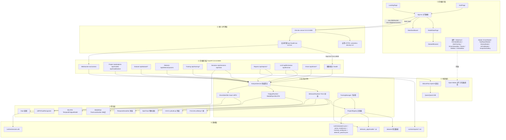

---

## 4. 模块详解

### 4.1 后端模块

#### 4.1.1 应用入口与配置

| 模块 | 职责 | 关键函数 (file:line) | 输入 | 输出 |
| --- | --- | --- | --- | --- |
| 进程入口 | 解析环境变量并启动 uvicorn | `backend/run.py`(读取 `DMS_HOST`/`DMS_PORT`/`DMS_RELOAD`,调用 `uvicorn.run('app.main:app',...)`) | 环境变量 | 监听 0.0.0.0:8000 |
| FastAPI 装配 | CORS、启动期目录创建、构造 service/registry/trainer | `backend/app/main.py:1-90`(模块级 `settings = get_settings()`, `service = AnalysisService(settings)`, `storage.init_db(SESSIONS_DB)`, `trainer = TrainingManager(...)`, `registry = service.behavior.registry`) | settings | FastAPI app |
| 配置 | `Settings` frozen dataclass 全量配置 | `backend/app/config.py:23-62` `Settings` / `get_settings` | `.env` | `Settings` 实例 |
| LLM 配置 | `LlmSettings` dataclass | `backend/app/llm.py:10-15` | `Settings.llm` | base_url/api_key/model/timeout |

关键启动期顺序:`backend/run.py` → 加载 `.env` → 构造 `Settings`(frozen)→ 构造 `AnalysisService`→ `init_db`→ 装配 CORSMiddleware(`allow_origin_regex='^https?://.*$'`)→ 注册路由。

#### 4.1.2 业务运行时

| 模块 | 职责 | 关键函数 (file:line) | 输入 | 输出 |
| --- | --- | --- | --- | --- |
| `AnalysisService` | 顶层聚合 behavior+fatigue+driver,实时/视频两种入口 | `backend/app/analysis.py:analyze_frame`、`analyze_video`、`_combine`、`_refresh_fatigue_async`、`_refresh_llm_async`、`_aggregate_video` | 帧/视频 | `AnalysisResult` dict |
| `BehaviorRuntime` | 封装 BehaviorDetector;管理 active model/参数/autolabel | `backend/app/analysis.py:55-220` `_load_detector`、`set_params`、`get_params`、`reload`、`active_model`、`set_active_model`、`autolabel`、`analyze`、`_fallback` | 帧 + Registry | 行为 events + persons |
| `FatigueRuntime` | MediaPipe + Haar 兜底 + BiLSTM 预测 + PERCLOS | `backend/app/analysis.py:260-637` `_load_feature_extractor`、`_load_predictor`、`extract_features`、`_extract_mediapipe_features`、`analyze_frame`、`_observable_signals`、`_apply_perclos`、`_predict_from_window`、`_merge_observable_scores`、`_public_result`、`_heuristic_scores` | 驾驶员脸帧 | 4 类标签 + risk_level + signals |
| `DriverIdentifier` | Haar 检测 + LBPH 训练/识别 | `backend/app/driver_id.py:21-110` `identify`、`register`、`_train`、`_detect_crop` | 帧 / 注册图 | `{name,status,distance,box}` |
| `ProjectRegistry` | 多项目注册表 + active_model 指针 | `backend/app/registry.py:44-240` `load_projects`、`create_project`、`delete_project`、`rename_project`、`list_with_stats`、`active_model`、`set_active_model`、`list_model_files`、`ensure_dataset_dirs`、`dataset_dir` | JSON 文件 | Project 状态 |
| `TrainingManager` | 子进程跑 YOLO + results.csv 解析 | `backend/app/training.py:14-110` `start`、`status`、`running` | cfg | TrainStatus |

#### 4.1.3 路由模块(`backend/app/main.py`)

| 分组 | 端点 | 关键函数 |
| --- | --- | --- |
| 健康 | `/health` | `health`(暴露 `llm_configured` 与 `service.capabilities()`) |
| 项目/模型 | `/api/projects`(GET/POST/DELETE/rename)、`/api/models`、`/api/model/active`(GET/POST) | `list_projects`、`create_project`、`delete_project`、`rename_project`、`list_models`、`set_active_model` |
| 数据集 | `/api/dataset/info`/`upload`/`images`/`image_file`/`image_upload`/`labels`/`image`(DEL)/`delete_batch`/`move`/`redistribute`/`augment`(_preview/clear_)/`export`/`autolabel`(_batch)/`video_frames`/`capture_frames` | `_dataset_dir`、`dataset_*` 一组路由 |
| 检测参数 | `/api/detector/params`(GET/POST) | `service.behavior.get_params`、`set_params` |
| 训练 | `/api/training/config`(GET/POST)、`/api/training/start`、`/api/training/status` | `_read_train_cfg`、`trainer.start`、`trainer.status` |
| 会话/统计 | `/api/sessions`(GET/POST/{id}/DEL)、`/api/stats` | `storage.create_session`、`list_sessions`、`get_session`、`get_stats` |
| 报告 | `/api/reports/{job_id}`(GET)、`/api/reports`(POST) | `service.write_result_report`、`FileResponse` |
| LLM | `/api/llm/review`、`/api/llm/chat` | `generate_review`、`generate_chat` |
| 驾驶员 | `/api/driver/register`、`/api/driver/list`、`/api/driver/{name}`(DEL) | `service.driver.register`、`list_drivers`、`delete` |
| WebSocket | `/ws/camera` | `backend/app/main.py:686-711` `loop.run_in_executor(None, partial(service.analyze_frame, ...))` |

#### 4.1.4 数据/评分/LLM/报告

| 模块 | 职责 | 关键函数 (file:line) |
| --- | --- | --- |
| `scoring` | Detection 归一化 + 综合分公式 | `backend/app/scoring.py:6-12`(`SEVERITY_PENALTY`)、`26-46`(`normalize_detection`)、`49-56`(`risk_level_to_score`)、`59-105`(`compute_driving_stats`) |
| `storage` | SQLite sessions 持久化 + 聚合 | `backend/app/storage.py:_connect`、`init_db`、`create_session`、`list_sessions`、`get_session`、`delete_session`、`get_stats:81-117` |
| `llm` | OpenAI 兼容协议 + 三档 prompt + 兜底 | `backend/app/llm.py:_post_chat:65-103`、`generate_llm_analysis`、`generate_review`(`REVIEW_SYSTEM:106-129`)、`generate_chat`(`CHAT_SYSTEM:113-152`)、`_fallback:29-33`、`_is_timeout_error:18-26` |
| `reports` | Markdown 渲染 | `backend/app/reports.py:7-53` `write_markdown_report` |
| `schemas` | 中文标签 + 风险映射 | `backend/app/schemas.py:BEHAVIOR_LABELS`(10 类)、`FATIGUE_LABELS`(4 类)、`RISK_TO_SEVERITY`(8 项) |
| `dataset` | YOLO 数据集 CRUD + 增强 | `backend/app/dataset.py:scan_dataset:38`、`list_images:148`、`add_single_image:252`、`move_image:206`、`redistribute_splits:224`、`augment_dataset:436`、`preview_augment:542`、`clear_augmented:587`、`save_uploaded_dataset:604`、`_next_seq:194` |

### 4.2 前端模块

#### 4.2.1 视图根

| 模块 | 职责 | 关键文件 / 函数 | 输入 | 输出 |
| --- | --- | --- | --- | --- |
| App 主控 | 视图状态机、WebSocket、HUD 编排 | `frontend/src/App.tsx:1-1111` `startCamera`、`startFrameWebSocket`、`pump`、`sendFrame`、`updateFromResult`、`captureSnapshot`、`saveSession` | `dms_user`/`getUserMedia` | 主驾驶舱 UI |
| Landing | 入口介绍 | `frontend/src/components/LandingPage.tsx` | — | Hero + 卡片 |
| 登录 | localStorage 演示态 | `frontend/src/components/AuthPage.tsx:10-41` | 用户名/密码 | 写入 `localStorage.dms_user` |
| 数据看板 | 跨会话统计 | `frontend/src/components/StatsDashboard.tsx` | `GET /api/stats` | SVG 趋势/条形图 |
| 模型与数据 | 项目/模型/数据集/训练 | `frontend/src/components/ModelDataPage.tsx:85-669` | `/api/projects`、`/api/models`、… | 七个卡片 |

#### 4.2.2 视频/检测核心组件

| 组件 | 职责 | 文件:行 | 关键算法/参数 |
| --- | --- | --- | --- |
| `VideoHud` | 四角取景框 + 扫描线 + FPS/延迟/帧号/模型 | `frontend/src/components/VideoHud.tsx` | 扫描周期 4.5s |
| `AnimatedBoxes` | RAF 60fps 识别框运动外推 | `frontend/src/components/AnimatedBoxes.tsx:40-150` | `posSmooth=0.45`/`sizeSmooth=0.28`/`velSmooth=0.35`/`maxExtrapMs=110`/`ttlMs=700`/`sizeDeadzone=0.35` |
| `AlertOverlay` | critical 红色边缘脉冲 + 顶部横幅 | `frontend/src/components/AlertOverlay.tsx:25` | 脉冲周期 1.1s |
| `DriverStatusBar` | 6 路驾驶员状态指示灯 | `frontend/src/components/DriverStatusBar.tsx` | present/seatbelt/hands/gaze/noPhone/noSmoke |
| `EventTimeline` | medium+ 事件时间轴 | `frontend/src/components/EventTimeline.tsx` | 可点击 seek(上传视频) |
| `Toasts` | 右下角事件 toast | `frontend/src/components/Toasts.tsx` | 3.8s 自动消失 |
| `videoBox.ts` | 视频像素 → CSS 绝对定位(letterbox) | `frontend/src/lib/videoBox.ts:7-23` | `scale=min(rw/vw,rh/vh)` |
| `useDriverAlerts` | 持续时长触发 + 冷却 + SpeechSynthesis | `frontend/src/lib/useDriverAlerts.ts:145-293` | `durationMs=700`、`cooldownMs=7000` |
| `statusSelectors` | 6 路状态推导(关键词匹配) | `frontend/src/statusSelectors.ts:16-28` | 关键词:无人/未系/离盘/视线/手机/吸烟 |

#### 4.2.3 弹窗/控制

| 组件 | 文件 | 主要职责 |
| --- | --- | --- |
| `ControlPanel` | `frontend/src/components/ControlPanel.tsx` | 上传/相机/开始/录制采样 + 数据集/时长/自动预标签设置 |
| `DriverModal` | `frontend/src/components/DriverModal.tsx:30-87` | `getUserMedia(480x360)` 采 8 张 → POST `/api/driver/register` |
| `AiChatModal` | `frontend/src/components/AiChatModal.tsx` | 三建议问 + history 后 6 条 → POST `/api/llm/chat` |
| `TripReportModal` | `frontend/src/components/TripReportModal.tsx` | 评分卡 + sparkline + 抓拍 + `window.print()` 导出 PDF |
| `HistoryModal` | `frontend/src/components/HistoryModal.tsx` | `GET /api/sessions` 列表 + 详情 |
| `SnapshotGallery` | `frontend/src/components/SnapshotGallery.tsx` | dataURL 缩略图 + 单张下载 + 清空 |
| `DatasetBrowser` | `frontend/src/components/DatasetBrowser.tsx:35-688` | 网格 + 编辑器 + 上传/视频抽帧/批量预标 |
| `InfoSidebar` | `frontend/src/components/InfoSidebar.tsx` | 行驶时长 / 交规提醒 / Open-Meteo 天气 / 打分机制 |
| `Sidebar` | `frontend/src/components/Sidebar.tsx` | 综合分 + 行为/疲劳分 + 检测列表 + ScoreTrend |

---

## 5. 算法设计

### 5.1 行为检测(YOLOv8 unified.pt + COCO 兜底 + 物体追踪 + 滑窗)

```mermaid
flowchart TD
  A[输入帧 frame] --> B{lens_covered?<br/>灰度Laplacian.var<10<br/>或灰度均值<15}
  B -- 是 --> Z1[返回 lens_covered<br/>camera_ok=False]
  B -- 否 --> C{is_low_light?<br/>灰度均值<80}
  C -- 是 --> D[CLAHE 低光增强<br/>clipLimit=3.0 tile=8x8]
  C -- 否 --> E[infer_frame]
  D --> E
  E --> F{realtime?}
  F -- 是 --> G1[model.track persist=True<br/>tracker=bytetrack.yaml]
  F -- 否 --> G2[model 普通推理]
  G1 --> H[_build_by_name 分级阈值过滤<br/>conf=0.35 smoking=0.55<br/>phone=0.55 drink/eat=0.55]
  G2 --> H
  H --> I{realtime + track_objects?}
  I -- 是 --> J[_track_coco_objects<br/>COCO yolov8s ByteTrack<br/>phone/cup/bottle/person<br/>TTL=6 帧沿用]
  I -- 否 --> K[_coco_scan 单次推理]
  J --> L[_from_unified 生成 events]
  K --> L
  L --> M{phone_use 命中?}
  M -- 是 --> M1[校验 confidence≥0.55<br/>COCO 框 _center_inside<br/>替换显示框 焊接到手机]
  M -- 否 --> M2{_phone_streak≥2<br/>且 COCO 有手机框?}
  M2 -- 是 --> M3[兜底补 phone_use]
  M2 -- 否 --> N
  M1 --> N
  M3 --> N
  N{有 phone_use?}
  N -- 是 --> N1[抑制 drinking/eating]
  N -- 否 --> O[_hands_event 反逻辑]
  N1 --> O
  O --> P{realtime?}
  P -- 是 --> P1[_suppress_background<br/>背景人面积<驾驶员*0.6 丢弃]
  P -- 否 --> Q
  P1 --> Q[TemporalSmoother.update<br/>window=6 activate=1 deactivate=3]
  Q --> R[_held_box 轨迹保持<br/>仅 realtime]
  R --> S[compute_risk_score<br/>概率互补 + dur_factor cap 1.6]
  S --> T[risk_tier<br/><10 safe / <30 attention<br/><60 warning / <85 danger / 其它 critical]
  T --> U[返回 dict<br/>behaviors/persons/<br/>driver_present/risk_score/<br/>alert_level/recommendation]
```

**关键公式**:

- 推理阈值:`infer_conf = min(conf, smoking_conf)`,真过滤在 `_build_by_name` 按类二次进行(`behavior_algo/behavior_detector.py:504-611`、`641-669`)。
- 风险评分:
  `score = 100 · (1 - ∏(1 - w·c·min(1.6, 1 + 0.06·min(d,10))))`
  权重表 `RISK_WEIGHT`:no_driver=1.00 / phone_use=0.80 / no_seatbelt=0.70 / hands_off_wheel=0.65 / smoking=0.45 / eating=0.55 / drinking=0.30 / lens_covered=0.40(`behavior_algo/behavior_detector.py:112-138`)。
- TemporalSmoother:`active[b]=True iff Σhistory[b] ≥ activate ∧ b∈seen`;`deactivate iff misses ≥ deactivate`(`behavior_algo/behavior_detector.py:171-210`)。

### 5.2 疲劳检测(MediaPipe + EAR/MAR/头姿 + PERCLOS + BiLSTM)

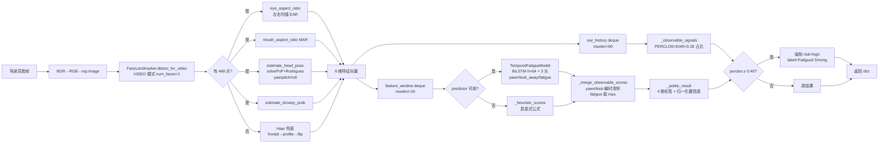

**关键公式**:

- **EAR**(`fatigue/src/fatigue_b/extract_features.py:85-89`):
  `EAR = (||p2-p6|| + ||p3-p5||) / (2·||p1-p4||)`,左右均值。
- **MAR**(`fatigue/src/fatigue_b/extract_features.py:92-96`):
  `MAR = (||p2-p8|| + ||p3-p7||) / (2·||p1-p5||)`。
- **头姿**(`extract_features.py:99-140`):`solvePnP` + `Rodrigues` 后 `pitch=atan2(R21,R22); yaw=atan2(-R20,sy); roll=atan2(R10,R00)`,再 `normalize_pose_angle` 映射到 `[-90,90]`。
- **drowsy_prob**(`extract_features.py:143-149`):`sigmoid(eye_term + 0.6·pose_term + 0.2·mouth_term - 1.4)`。
- **PERCLOS**(`backend/app/analysis.py:458-484`):`perclos = #(EAR<0.18) / N_valid`,`≥0.45` 强制升级。
- **窗口启发式**:`fatigue_signal = 0.50·eye_closure_ratio + 0.25·P90(low_ear) + 0.15·P90(nod) + 0.10·P90(drowsy)`(`analysis.py:604-637`)。
- **合并策略**:yawn/look 用「瞬时清除」(嘴一闭立刻归零)、fatigue 慢变取 max(`_merge_observable_scores:552-565`)。

### 5.3 驾驶员识别(Haar + LBPH)

```mermaid
flowchart TD
  A[输入帧 BGR] --> B[cvtColor 灰度]
  B --> C[CascadeClassifier.detectMultiScale<br/>scaleFactor=1.1 minNeighbors=5<br/>minSize=80x80]
  C --> D{faces 非空?}
  D -- 否 --> Z1[返回 status=no_face]
  D -- 是 --> E{cv2.face 可用<br/>且 recognizer 已训?}
  E -- 否 --> F[取最居中脸<br/>status=no_model]
  E -- 是 --> G[对每个 face<br/>resize 160x160 灰度]
  G --> H[recognizer.predict<br/>得 label, dist]
  H --> I{dist ≤ MATCH_THRESHOLD=68?}
  I -- 否 --> J[继续遍历]
  J --> H
  I -- 是 --> K[best = argmin dist]
  K --> L{best 非空?}
  L -- 否 --> M[取最居中脸<br/>status=unknown]
  L -- 是 --> N[返回 name=labels[label]<br/>status=known<br/>distance + box]
```

**LBPH 算法简述**:LBPH(Local Binary Patterns Histograms)对每张训练人脸做局部二值模式编码,把整张图切成小格、为每格统计 LBP 直方图,再把所有直方图拼接成特征向量。预测时用 chi-square 距离比较与每个人的特征向量距离,距离越小越像。它对光照变化具有一定鲁棒性(因为只看相邻像素灰度大小关系),但对大角度、表情、遮挡敏感。MATCH_THRESHOLD=68 是经验阈值,典型 <50 极像、<80 可接受。每次 `register`/`delete` 后 `_train` 全量重训(O(N)),通常车主样本 <30 张,可接受(`backend/app/driver_id.py:39-56,89-104`)。

### 5.4 驾驶员区域混合收口

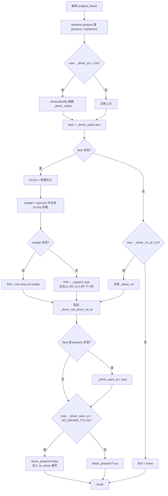

注意:实时主路径中 `analyze_frame` 显式将 `roi=None`(`backend/app/analysis.py:759`),避免动作框被小 ROI 误丢,因此 `_resolve_driver_roi`/`_gate_behavior_to_driver` 主要为视频/历史路径保留;实时只依赖 `NO_DRIVER_TTL` 做无人判定。

### 5.5 行为收口与疲劳脸裁剪

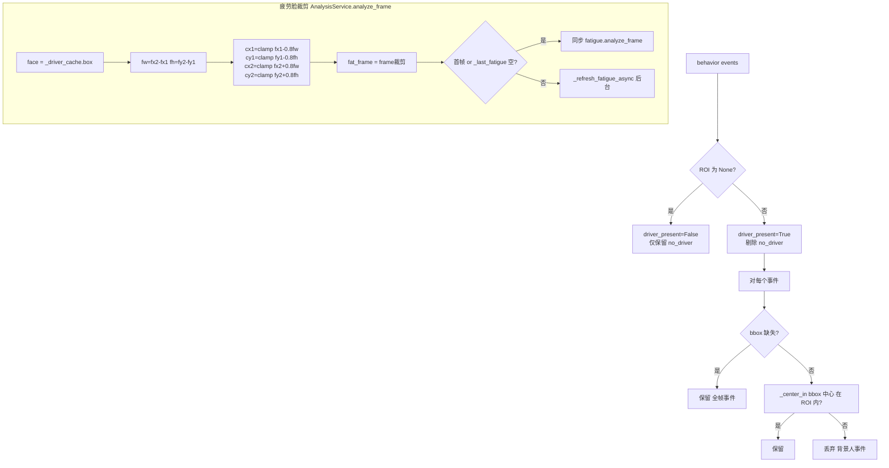

裁剪 padding=0.8×fw/fh 是为了把 MediaPipe 的搜索域聚焦在驾驶员脸,减少背景人脸干扰并提高命中率(`backend/app/analysis.py:782-794`)。

### 5.6 风险评分公式

**Detection 归一化**(`backend/app/scoring.py:26-46`):统一字段 `{id,type,code,timestamp:mm:ss,confidence:round(4),severity,source,bbox?}`。

**综合分**(`backend/app/scoring.py:59-105`):

```
severity_penalty = Σ_{i<8} SEVERITY_PENALTY[severity_i]
base_penalty     = behavior_risk·0.42 + fatigue_risk·0.36 + severity_penalty
                  + 25·¬driver_present + 20·¬camera_ok
score            = clamp(100 - base_penalty, 0, 100)
```

**SEVERITY_PENALTY 表**(`scoring.py:6-12`):

| severity | none | low | medium | high | critical |
| --- | --- | --- | --- | --- | --- |
| 扣分 | 0 | 4 | 9 | 16 | 30 |

**多维分**(均 clamp [0,100]):

| 维度 | 公式 |
| --- | --- |
| `behavior_score` | `100 - behavior_risk·0.7 - severity_penalty - 25·¬driver_present - 20·¬camera_ok` |
| `fatigue_score` | `100 - fatigue_risk` |
| `focus` | `100 - behavior_risk·0.65 - 25·¬driver_present` |
| `reaction` | `100 - fatigue_risk·0.55 - behavior_risk·0.15` |
| `compliance` | `100 - behavior_risk·0.55 - severity_penalty·0.7` |
| `stability` | `100 - behavior_risk·0.25 - fatigue_risk·0.25 - 25·¬camera_ok` |

**status 阈值表**:

| score 区间 | status |
| --- | --- |
| `≥80` | 正常 |
| `[60,80)` | 注意 |
| `[40,60)` | 警告 |
| `<40` | 危险 |

**risk_tier 阈值表**(行为检测端,`behavior_algo/behavior_detector.py:141-150`):

| risk_score | tier |
| --- | --- |
| `<10` | safe |
| `<30` | attention |
| `<60` | warning |
| `<85` | danger |
| `≥85` | critical |

**risk_level→score**(`scoring.py:49-56`):`high→80 / medium→55 / low→12 / 其他→0`。

### 5.7 标注与训练管线

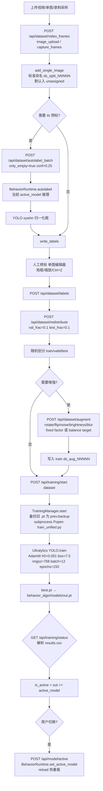

---

## 6. 关键流程图

### 6.1 实时摄像头分析全流程

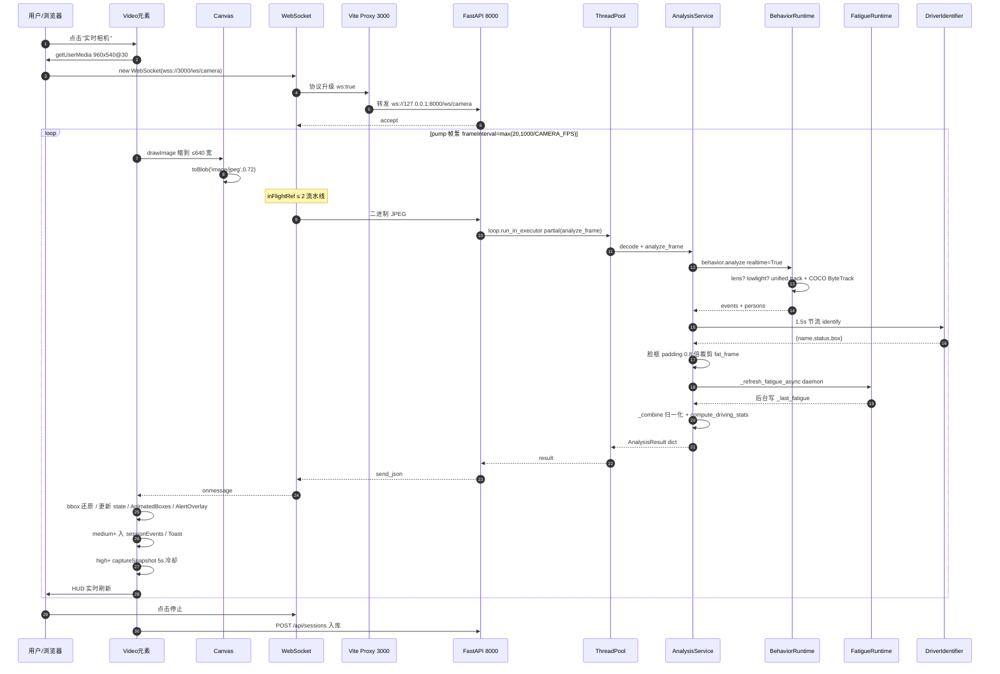

### 6.2 视频上传离线分析

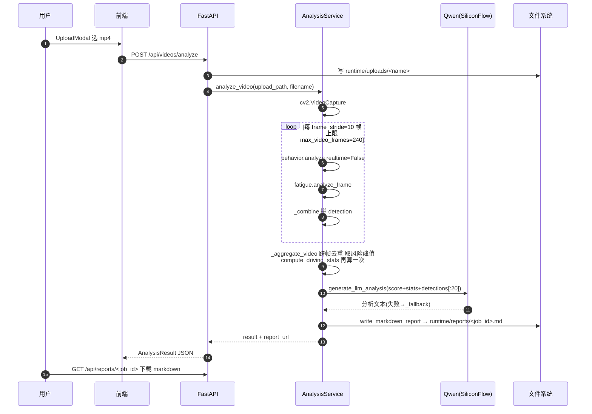

### 6.3 数据集标注 + 训练 + 模型切换全流程

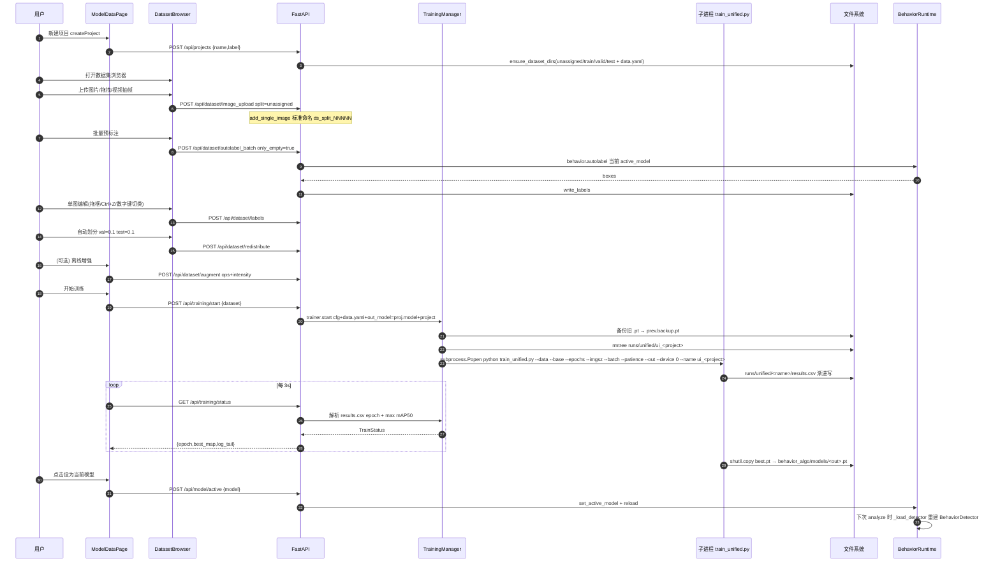

### 6.4 驾驶员锁定决策(状态图)

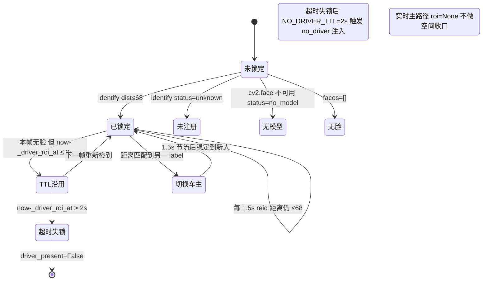

---

## 7. 数据流图

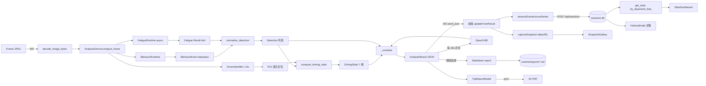

---

## 8. 接口约定

### 8.1 REST 端点完整表格

#### Project / Model

| 方法 | 路径 | 用途 | 入参 | 出参 |
| --- | --- | --- | --- | --- |
| GET | `/api/projects` | 列项目+统计 | — | `{projects:[ProjectStat],active_model}` |
| POST | `/api/projects` | 新建空项目 | `{name,label}` | `{created,projects}` |
| DELETE | `/api/projects/{name}` | 删非内置项目 | path | `{deleted,reset_active,projects,active_model}` |
| POST | `/api/projects/{name}/rename` | 改 label / name | `{new_label?,new_name?}` | `{project,projects,active_model}` |
| GET | `/api/models` | 列 `behavior_algo/models/*.pt` | — | `{models,active_model}` |
| GET | `/api/model/active` | 查当前生效模型 | — | `{active_model}` |
| POST | `/api/model/active` | 切换并热重载 | `{model}` | `{active_model,projects}` |

#### Dataset

| 方法 | 路径 | 用途 | 入参 | 出参 |
| --- | --- | --- | --- | --- |
| GET | `/api/dataset/info` | 扫描概览 | `?dataset` | `{active,uploads}` |
| POST | `/api/dataset/upload` | zip 解压 | multipart `file` | `{...,scan}` |
| GET | `/api/dataset/images` | 分页列图 | `?split&cls&issue&page&page_size` | `{total,items,...}` |
| GET | `/api/dataset/image_file` | 取单图 | `?split&name&dataset` | image bytes |
| POST | `/api/dataset/image_upload` | 上传单图 | Form `split,dataset,file` | `{name,split}` |
| POST | `/api/dataset/labels` | 写 YOLO 标注 | `{split,name,boxes[]}` | `{saved}` |
| DELETE | `/api/dataset/image` | 删图 | `?split&name` | `{deleted}` |
| POST | `/api/dataset/delete_batch` | 批量删 | `{split,names[]}` | `{deleted,total}` |
| POST | `/api/dataset/move` | 跨 split 移动 | `{split,name,to_split}` | `{moved}` |
| POST | `/api/dataset/redistribute` | 自动划分 | `{val_frac=0.1,test_frac=0.1}` | `{total,moved,splits}` |
| POST | `/api/dataset/augment` | 离线增强落盘 | `{ops,factor / target_per_class,intensity}` | `{generated,...}` |
| POST | `/api/dataset/augment_preview` | 预览 4 张 | 同上 + `count=4` | `{previews}` |
| POST | `/api/dataset/clear_augment` | 清 aug 样本 | `{dataset}` | `{removed}` |
| GET | `/api/dataset/export` | 下载 zip | `?dataset` | zip |
| POST | `/api/dataset/autolabel` | 单图 AI 标 | `{split,name,conf=0.25}` | `{boxes,note,model}` |
| POST | `/api/dataset/autolabel_batch` | 批量 AI 标 | `{split,only_empty,conf}` | `{processed,labeled,boxes,note,model}` |
| POST | `/api/dataset/video_frames` | 视频抽帧 | multipart `every_sec,max_frames,file` | `{saved,fps,every_sec,names}` |
| POST | `/api/dataset/capture_frames` | 录制采样 | `{frames[],autolabel,conf}` | `{saved,labeled,boxes,...}` |

#### Detector / Training

| 方法 | 路径 | 用途 | 入参 | 出参 |
| --- | --- | --- | --- | --- |
| GET | `/api/detector/params` | 查 4 路阈值 | — | `{conf,smoking_conf,phone_use_conf,drink_eat_conf}` |
| POST | `/api/detector/params` | 热改阈值 | 同上 | 更新后 |
| GET | `/api/training/config` | 查训练超参 | — | `{base,epochs,imgsz,batch,patience}` |
| POST | `/api/training/config` | 改训练超参(白名单) | 同上 | 合并后 |
| POST | `/api/training/start` | 启动训练子进程 | `{dataset}` | TrainStatus |
| GET | `/api/training/status` | 训练状态 + log_tail | — | `{running,epoch,total_epochs,best_map,is_active,...}` |

#### Driver / Sessions / Stats / Reports / LLM / Health

| 方法 | 路径 | 用途 |
| --- | --- | --- |
| POST | `/api/driver/register` | 登记 8 张人脸,LBPH 重训 |
| GET | `/api/driver/list` | 车主列表 |
| DELETE | `/api/driver/{name}` | 删车主 |
| POST | `/api/sessions` | 保存行程 |
| GET | `/api/sessions` | 最近 50 条 |
| GET | `/api/sessions/{id}` | 详情 |
| DELETE | `/api/sessions/{id}` | 删 |
| GET | `/api/stats` | 跨会话聚合 |
| GET | `/api/reports/{job_id}` | 下载 markdown |
| POST | `/api/reports` | 渲染并落盘 |
| POST | `/api/llm/review` | 教练点评 |
| POST | `/api/llm/chat` | 上下文问答 |
| GET | `/health` | 健康检查 |

### 8.2 WebSocket `/ws/camera` 协议

- **建立**:浏览器侧 `new WebSocket(websocketUrl('/ws/camera'))`,`binaryType='arraybuffer'`;Vite 反代 `ws:true` 完成 HTTP→WS 升级。
- **上行**:每帧由浏览器 `video.drawImage` 到 `canvas`、`canvas.toBlob('image/jpeg', 0.72)` 后 `ws.send(blob)`,缩放上限 `SEND_MAX_WIDTH=640`;最多允许 `inFlightRef ≤ 2` 帧在途。
- **下行**:服务端 `await websocket.receive_bytes()` → `decode_image_bytes` → `loop.run_in_executor(None, partial(service.analyze_frame, frame, frame_id=...))` → `websocket.send_json(result)`,result 即 `AnalysisResult` JSON。
- **错误**:单帧异常 send `{error, frame_id}`;`WebSocketDisconnect` 退出循环(`backend/app/main.py:686-711`)。

---

## 9. 数据模型

### 9.1 后端关键 dataclass / dict

**`Settings`**(`backend/app/config.py:23-35`):

| 字段 | 类型 | 含义 |
| --- | --- | --- |
| `repo_root` | `Path` | 仓库根 |
| `runtime_dir` | `Path` | 运行期目录 |
| `allowed_origins` | `list[str]` | CORS 白名单 |
| `allowed_origin_regex` | `str` | CORS 正则(默认 `^https?://.*$`) |
| `llm` | `LlmSettings` | LLM 子配置 |
| `yolo_device` | `str` | auto/cpu/cuda |
| `frame_stride` | `int=10` | 视频采样步长 |
| `max_video_frames` | `int=240` | 单视频上限 |
| `fatigue_*_threshold` | `float` | 三阈值 0.55/0.55/0.60 |

**`LlmSettings`**(`backend/app/llm.py:10-15`):`base_url / api_key / model / timeout_seconds=60`。

**`BehaviorEvent`**(`behavior_algo/behavior_detector.py:155`):

| 字段 | 类型 | 含义 |
| --- | --- | --- |
| `type` | `str` | 行为代码 |
| `label_zh` | `str` | 中文标签 |
| `confidence` | `float` | 置信度 |
| `bbox` | `list[int]?` | xyxy |
| `severity` | `str` | none/low/medium/high/critical |
| `duration_s` | `float` | 持续时长 |
| `evidence` | `str` | 触发证据 |

**行为 result(predict 返回)**(`behavior_algo/behavior_detector.py:821-834`):

| 字段 | 含义 |
| --- | --- |
| `frame_id/timestamp/latency_ms` | 元信息 |
| `mode` | `unified/base/lens_covered` |
| `behaviors` | `List[dict]` 稳态事件 |
| `alert_level` | `none/low/medium/high/critical` |
| `risk_score` | 0~100 |
| `risk_tier` | safe/attention/warning/danger/critical |
| `recommendation` | 文案 |
| `driver_present` | bool |
| `camera_ok` | bool |
| `persons` | `List[List[int]]` |

**`AnalysisResult`**(`frontend/src/types.ts:68`):

| 字段 | 含义 |
| --- | --- |
| `job_id` | 视频任务 ID |
| `source` | `{kind,name}` |
| `frame_id`/`timestamp` | 元信息 |
| `stats` | DrivingStats |
| `detections` | Detection[] 累计 |
| `frame_detections` | Detection[] 本帧 |
| `current_behavior` | BehaviorSummary |
| `current_fatigue` | FatigueSummary |
| `driver` | `{name,status,distance?,box?}` |
| `driver_roi` | `number[]\|null` |
| `driver_present` | bool |
| `llm_analysis` | 文本 |
| `report_url` | `/api/reports/...` |
| `capabilities` | behavior/fatigue/llm |
| `metrics` | `{latency_ms,behavior_risk,fatigue_risk,frames_*,fps}` |

**`DrivingStats`**(`frontend/src/types.ts:15`):`score, status, behavior_score?, fatigue_score?, focus, reaction, compliance, fatigue, stability`。

**`Detection`**(`types.ts:3`):`id, type, code?, timestamp, confidence, severity, source, bbox?, vt?`。

**`Snapshot`**(`SnapshotGallery.tsx:4`):`id, url(dataURL jpeg), label, severity, t, wall(ms)`,容量 24。

**`TimelineEvent`**(`EventTimeline.tsx:5`):`id, t:number, label, severity`。

**`Settings` 前端**(`App.tsx:87`):`voice/hud/scanline/statusBar/spotlight`。

**`ProjectStat`**:`name, label, model, builtin, dataset_exists, images:{train,valid,test}, model_exists, model_size_mb, active`。

**`TrainStatus`**:`running, started, started_at, project?, out_model?, epoch, total_epochs, best_map, finished, success, elapsed, log_tail, active_model?, is_active?`。

**`Fatigue Result`**:`module, model_name, frame_id, timestamp, label∈{Normal,Yawning,Looking Around,Fatigued Driving}, confidence, indicators:{yawn_score,look_away_score,fatigue_score}, risk_level∈{low,medium,high}, public_scores, signals, capability`。

**`signals`**:`perclos, ear, eyes_closed, head_yaw/pitch/roll, gaze_zone∈{前方,左盼,右顾,低头,闭眼}`。

### 9.2 SQLite sessions schema

`backend/app/storage.py:init_db / create_session`:

| 列 | 类型 | 含义 |
| --- | --- | --- |
| `id` | `TEXT PRIMARY KEY` | `uuid4().hex[:12]` |
| `created_at` | `REAL` | unix timestamp |
| `source` | `TEXT (≤120)` | 来源串 |
| `duration` | `REAL` | 秒 |
| `score_avg` | `REAL` | 平均综合分 |
| `score_min` | `REAL` | 最低分 |
| `behavior_avg` | `REAL` | 行为均值 |
| `fatigue_avg` | `REAL` | 疲劳均值 |
| `events_count` | `INTEGER` | 事件数 |
| `payload` | `TEXT` | 整个会话 JSON(`json.dumps(ensure_ascii=False)`,含 events 全量) |

---

## 10. 部署架构

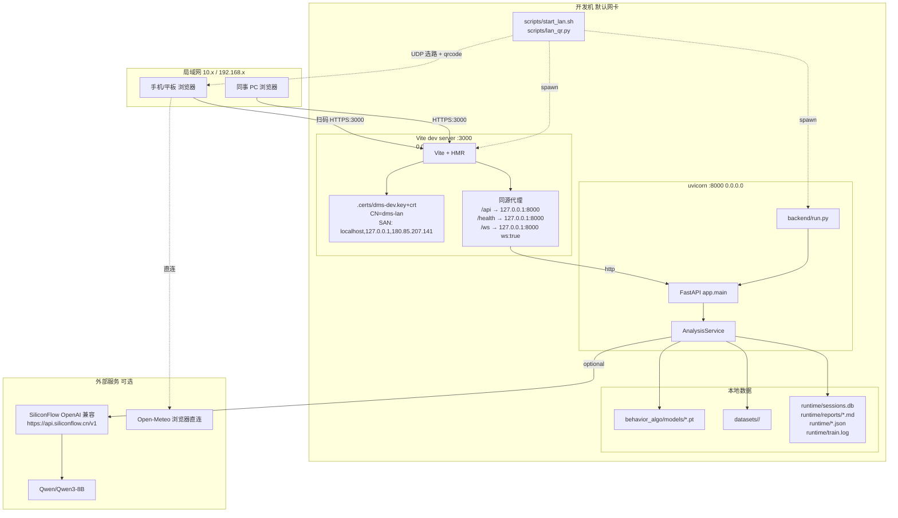

**端口 / CORS / .env 说明**:

- **端口模型**:对外只暴露 `:3000`,后端 `:8000` 可保持 `127.0.0.1` 或同样 0.0.0.0;Vite 同源代理解决「HTTPS 页面访问 HTTP 后端 / wss 升级」两个浏览器障碍。
- **CORS**(`backend/app/config.py:42-50`):
  - `DMS_ALLOWED_ORIGINS` 显式白名单(默认 `http://localhost:3000,http://127.0.0.1:3000`);
  - `DMS_ALLOWED_ORIGIN_REGEX` 默认 `^https?://.*$` 放行任意来源以支持手机扫码;
  - `allow_credentials=True`, `allow_methods=*`, `allow_headers=*`(`backend/app/main.py:57-64`)。
  - 实际同源代理场景浏览器不发 CORS 预检,正则放宽不暴露风险。
- **.env**:
  - 后端 `backend/.env`:`SILICONFLOW_BASE_URL/API_KEY/MODEL`、`DMS_HOST/PORT/RELOAD`、`DMS_RUNTIME_DIR`、`DMS_FATIGUE_*_THRESHOLD`、`DMS_YOLO_DEVICE`、`DMS_FRAME_STRIDE`、`DMS_MAX_VIDEO_FRAMES`。
  - 前端 `frontend/.env`:`VITE_BACKEND_URL=`(留空 → 同源,推荐)、`VITE_CAMERA_FPS=16`、`VITE_DRIVER_ALERT_DURATION_MS=700`、`VITE_DRIVER_ALERT_COOLDOWN_MS=7000`;`.env.example` 与 `.env` 在 `VITE_CAMERA_FPS` 默认值不同(3 vs 16)需注意。
- **HTTPS 触发**:`npm run dev:https` 或环境变量 `DMS_HTTPS=1` → `frontend/vite.config.ts:13-22` 读取仓库根 `.certs/dms-dev.{key,crt}` 注入 `server.https`,否则走 HTTP。
- **二维码**:`scripts/lan_qr.py:14-23` 用 `socket.SOCK_DGRAM connect 8.8.8.8:80 → getsockname()[0]` 拿出口 IP;根据 `frontend/certs/cert.pem` 是否存在自动选 https/http,`qrcode` 打印 ASCII。

---

## 11. 目录结构

```text
jqxx/
├── backend/                       # 后端 FastAPI 应用
│   ├── run.py                     # uvicorn 入口
│   ├── app/                       # 业务模块
│   │   ├── main.py                # FastAPI 路由总装
│   │   ├── config.py              # Settings 装配
│   │   ├── analysis.py            # AnalysisService + BehaviorRuntime + FatigueRuntime
│   │   ├── behavior /             # 行为相关辅助
│   │   ├── driver_id.py           # DriverIdentifier
│   │   ├── registry.py            # ProjectRegistry
│   │   ├── training.py            # TrainingManager
│   │   ├── dataset.py             # YOLO 数据集 CRUD
│   │   ├── storage.py             # SQLite 会话
│   │   ├── scoring.py             # 评分公式
│   │   ├── reports.py             # Markdown 报告渲染
│   │   ├── llm.py                 # SiliconFlow + Qwen
│   │   └── schemas.py             # 中文标签
│   ├── runtime/                   # 运行期数据(sessions.db / reports / uploads / *.json / train.log)
│   └── .env                       # 后端配置
├── behavior_algo/                 # YOLO 行为识别算法库
│   ├── behavior_detector.py       # BehaviorDetector + TemporalSmoother
│   ├── models/                    # *.pt 权重 (unified.pt / yolov8s.pt / 自训项目.pt)
│   ├── scripts/                   # 训练入口 + 数据构建脚本
│   │   ├── train_unified.py       # YOLO 训练命令
│   │   └── build_reckless_mapped.py # 7 类 schema 重映射
│   └── runs/                      # Ultralytics 训练产物 + results.csv
├── fatigue/                       # 疲劳检测算法库
│   ├── src/fatigue_b/             # 特征 + 模型 + 推理
│   │   ├── extract_features.py    # MediaPipe + EAR/MAR/头姿
│   │   ├── model.py               # TemporalFatigueModel BiLSTM
│   │   ├── infer.py               # FatigueBPredictor
│   │   ├── config.py              # 阈值 + 公共标签判定
│   │   ├── metrics.py             # 训练评估
│   │   └── runtime.py             # 设备解析
│   ├── outputs/fatigue_b/checkpoints/best_model.pt
│   └── models/mediapipe/face_landmarker.task
├── datasets/                      # 用户数据集根
│   ├── reckless_mapped/           # 内置基础项目(builtin)
│   └── <自建项目>/                # unassigned/train/valid/test/{images,labels}+data.yaml
├── frontend/                      # 前端 React + Vite
│   ├── src/
│   │   ├── App.tsx                # 主控
│   │   ├── main.tsx               # 入口
│   │   ├── types.ts               # 类型
│   │   ├── statusSelectors.ts     # 6 路状态推导
│   │   ├── components/            # 视图组件 + Modal + 标注/模型页
│   │   └── lib/                   # useDriverAlerts / videoBox
│   ├── certs/                     # 自签证书(配合 lan_qr.py 判定)
│   ├── vite.config.ts             # 同源代理 + HTTPS
│   ├── package.json               # dev / dev:https 脚本
│   ├── .env / .env.example        # 前端运行参数
│   └── index.html
├── scripts/                       # 部署运维
│   ├── start_lan.sh               # 一键并行启动 + 打印二维码
│   └── lan_qr.py                  # UDP 选路 + ASCII 二维码
├── .certs/dms-dev.{key,crt}       # Vite 实际加载的自签证书
├── docs/                          # 文档(本文件位于此处)
└── yolov8s.pt / yolov8n.pt        # COCO 兜底权重
```

---

## 12. 关键阈值与可调参数清单

### 12.1 行为检测

| 名称 | 默认 | 含义 | 位置 |
| --- | --- | --- | --- |
| `conf` | 0.35 | unified 通用阈值 | `behavior_detector.py:246`、`analysis.py:119` |
| `smoking_conf` | 0.55 | smoking 类阈值 | 同上 |
| `phone_use_conf` | 0.55 | phone_use 阈值 | 同上 |
| `drink_eat_conf` | 0.55 | drinking/eating 阈值 | 同上 |
| `iou` | 0.5 | NMS IoU | `behavior_detector.py:247` |
| `imgsz` | 640 | YOLO 输入边长 | `behavior_detector.py:248` |
| `low_light_enhance` | True | CLAHE 增强开关 | `behavior_detector.py:249` |
| `verify_phone` | True | COCO 物体追踪开关 | `behavior_detector.py:251` |
| `phone_verify_conf` | 0.15 | COCO 推理低阈值(追踪用) | `behavior_detector.py:252` |
| `obj_track_ttl` | 6 帧 | 物体框沿用 TTL | `behavior_detector.py:320` |
| `phone_coco_conf` | 0.25 | COCO 手机触发门槛 | `behavior_detector.py:336` |
| `phone_streak_min` | 2 帧 | 手机连续命中 | `behavior_detector.py:337` |
| `phone_upper_ratio` | 0.85 | 手机中心 y 上限 | `behavior_detector.py:338` |
| `hands_off_streak_min` | 2 | 离盘连续命中 | `behavior_detector.py:306` |
| `bg_person_area_ratio` | 0.6 | 背景人面积 ÷ 驾驶员 | `behavior_detector.py:330` |
| `TemporalSmoother window/activate/deactivate` | 6/1/3 | 滑窗参数 | `behavior_detector.py:297` |
| `lens_var<` | 10 | Laplacian 阈 | `behavior_detector.py:483-488` |
| `low_light<` | 80 | 灰度均值阈 | `behavior_detector.py:498-500` |
| `dur_factor` cap | 1.6 | 时长因子上限 | `behavior_detector.py:135` |

### 12.2 疲劳

| 名称 | 默认 | 含义 | 位置 |
| --- | --- | --- | --- |
| `thresholds.yawn` | 0.55 | Yawn 阈值 | `analysis.py:271`、`fatigue/.../config.py:26` |
| `thresholds.look_away` | 0.55 | Look 阈值 | 同上 |
| `thresholds.fatigue` | 0.60 | Fatigue 阈值 | 同上 |
| `DMS_FATIGUE_*` | 同上 | env 覆盖 | `config.py:60-62` |
| `EYE_CLOSED_EAR` | 0.18 | 闭眼判定 | `analysis.py:445` |
| `PERCLOS_HIGH` | 0.45 | 强升 high 门槛 | `analysis.py:477` |
| `window_size` | 16 | BiLSTM 输入窗 | `analysis.py:261` |
| `ear_history maxlen` | 90 | PERCLOS 窗 | `analysis.py:266` |
| MediaPipe `num_faces` | 1 | 单脸 | `extract_features.py:55` |
| MediaPipe 三阈值 | 0.5 | det/presence/track | `extract_features.py:56-58` |
| Haar `scale/min/minSize` | 1.1/4/(60,60) | 兜底 | `extract_features.py:156` |
| BiLSTM hidden / layers / dropout | 64/1/0.2 | 模型结构 | `model.py:13-15` |
| 启发式权重 | 0.50/0.25/0.15/0.10 | eye/low_ear/nod/drowsy | `analysis.py:624-629` |
| 脸裁剪 padding | 0.8 × fw/fh | 给 MediaPipe | `analysis.py:786-792` |
| `gaze_zone` 阈值 | ear<0.13 / |pitch|>18 / |yaw|>20 | 标签离散化 | `analysis.py:448-455` |

### 12.3 驾驶员

| 名称 | 默认 | 含义 | 位置 |
| --- | --- | --- | --- |
| `MATCH_THRESHOLD` | 68.0 | LBPH 距离阈 | `driver_id.py:16` |
| `FACE_SIZE` | (160,160) | 训练/识别尺寸 | `driver_id.py:17` |
| Haar `scale/min/minSize` | 1.1/5/(80,80) | 检测 | `driver_id.py:33` |
| name 长度 | 40 字 | 截断 | `driver_id.py:61` |
| `DRIVER_REID_INTERVAL` | 1.5 s | 重识别节流 | `analysis.py:665` |
| `DRIVER_ROI_TTL` | 2.0 s | ROI 沿用 | `analysis.py:664` |
| `NO_DRIVER_TTL` | 2.0 s | 无人判定 | `analysis.py:666` |
| `_expand_face` 系数 | 左右 ±1.1fw / 上 -0.3fh / 下 +3fh | 躯干扩展 | `analysis.py:681-682` |

### 12.4 数据集 / 训练

| 名称 | 默认 | 含义 | 位置 |
| --- | --- | --- | --- |
| `STANDARD_NAMES` | 7 类 schema | phone_use,smoking,drinking,eating,hand_on_wheel,hands_off_wheel,seatbelt | `registry.py:18` |
| `DEFAULT_DATASET` | reckless_mapped | 兜底项目 | `main.py:34` |
| `page_size` 网格 | 24 | 分页 | `DatasetBrowser.tsx:89` |
| `aiConf` | 0.25 | AI 预标 | `DatasetBrowser.tsx:54` |
| `everySec / maxFrames` 视频抽帧 | 1.0 / 60(上限 500) | 抽帧密度 | `DatasetBrowser.tsx:52-53` |
| 录制采样上限 | 120(后端) / 360(前端) | 总帧数 | `main.py:532` / `App.tsx:634` |
| `HUGE_AREA / TINY_AREA / MAX_BOX_AREA` | 0.85 / 0.003 / 0.85 | 质量分桶 | `dataset.py:19` / 构建脚本 |
| `AUG_INTENSITY_DEFAULTS` | max_deg=15 / σ=18 / brightness=30 / blur_ksize=9 | 增强默认强度 | `dataset.py:337` |
| `augFactor` 范围 | 1..10 | 固定份数 | `ModelDataPage.tsx:97` |
| `augTarget` 范围 | 1..5000 | 均衡目标 | `ModelDataPage.tsx:102` |
| `TRAIN_CFG_DEFAULT` | base=yolov8s.pt / epochs=150 / imgsz=768 / batch=12 / patience=30 | UI 训练默认 | `main.py:29` |
| 训练 device / workers | `'0'` / 2 | GPU + DataLoader | `training.py:53`、`train_unified.py:50` |
| 数据增强超参 | hsv_h=0.015 hsv_s=0.7 hsv_v=0.4 mosaic=1.0 mixup=0.1 copy_paste=0.1 | YOLO 内增强 | `train_unified.py:79` |
| 优化器 | AdamW lr0=0.001 lrf=0.01 wd=5e-4 warmup=3 | 默认 | `train_unified.py:82` |
| 损失权重 | box=7.5 cls=0.5 dfl=1.5 | 小物体提权 | `train_unified.py:85` |
| 训练状态轮询间隔 | 3000 ms | 前端 | `ModelDataPage.tsx:133` |

### 12.5 前端

| 名称 | 默认 | 含义 | 位置 |
| --- | --- | --- | --- |
| `CAMERA_FPS` | 30(代码)/16 或 3(.env) | 发帧上限 | `App.tsx:35` |
| `SEND_MAX_WIDTH` | 640 | 缩放上限 | `App.tsx:36` |
| JPEG quality | 0.72(实时)/0.85(录制)/0.8(抓拍) | 编码质量 | App.tsx 多处 |
| `inFlightRef` | ≤2 | 流水线深度 | `App.tsx:484` |
| `boxesFresh` 超时 | 600 ms | 清空识别框 | `App.tsx:240` |
| snapshots 容量 / 冷却 | 24 / 5000 ms | 抓拍 | `App.tsx:167/258` |
| Toast 容量 / 时长 | 4 / 3800 ms | UI | `App.tsx:264-265` |
| `scoreSeries` 容量 | 1200 | 内存上限 | `App.tsx:224` |
| `sessionEvents` 容量 | 200 | | `App.tsx:254` |
| `saveSession` 最小长度 | 3 | 防垃圾会话 | `App.tsx:383` |
| `health` 间隔 | 5000 ms | | `App.tsx:296` |
| getUserMedia 实时 / 登记 | 960×540@30 / 480×360 | | `App.tsx:545` / `DriverModal.tsx:30` |
| 登记人脸数 | 8(每张 220 ms) | LBPH 样本 | `DriverModal.tsx:87` |
| `VITE_DRIVER_ALERT_DURATION_MS` | 700 | 持续触发门槛 | `useDriverAlerts.ts:147` |
| `VITE_DRIVER_ALERT_COOLDOWN_MS` | 7000 | 语音冷却 | `useDriverAlerts.ts:149` |
| AnimatedBoxes 平滑系数 | pos=0.45 size=0.28 vel=0.35 ttl=700 maxExtrap=110 deadzone=0.35 | 视觉外推 | `AnimatedBoxes.tsx:42-44` |
| AlertOverlay critical 周期 | 1.1 s | 脉冲 | `AlertOverlay.tsx:25` |
| VideoHud 扫描周期 | 4.5 s | HUD 视觉 | `VideoHud.tsx:32` |
| `REST_LIMIT` 行驶疲劳 | 7200 s(2h) | InfoSidebar 红色提醒 | `InfoSidebar.tsx:9` |

---

## 13. 已知限制与后续可扩展方向

### 13.1 已知限制

1. **LBPH 对大姿态弱**:LBPH 主要靠光照不变的局部 LBP,姿态/表情/遮挡变化大时容易掉到 `unknown`,需要补充更多角度的样本或换 MobileFaceNet/InsightFace。
2. **MediaPipe `num_faces=1`**:为聚焦驾驶员故意只检最显著一张脸,因此 **必须先做脸裁剪**,否则一旦背景人脸更显著会切错(`fatigue/src/fatigue_b/extract_features.py:55`)。
3. **自签 HTTPS 警告**:首次扫码访问 `https://<内网IP>:3000` 浏览器会提示证书不受信任,需点"高级 → 继续前往"。证书 SAN 写死 `180.85.207.141`,换网段需重签。
4. **两套证书并存**:`scripts/lan_qr.py` 检测 `frontend/certs/cert.pem`,Vite 实际加载 `.certs/dms-dev.*`,内容相同但路径不一致,部署到新机器需同步更新。
5. **视频上传路径未做驾驶员收口**:`analyze_video` 现在没有走 `_resolve_driver_roi`+`_gate_behavior_to_driver`(实时路径也显式 `roi=None`),所以离线视频中的背景人误报抑制依赖 `_suppress_background` 与 `_phone_near_face` 的几何约束,不会用车主身份。
6. **登录是 localStorage 演示态**(`AuthPage.tsx:10-41`),无服务端校验,不可用于生产。
7. **realtime.pt / video.pt 模型质量** 已知差(来自 `MEMORY.md` 提示),实时检测建议锁 `unified.pt`。
8. **视频离线分析的 LLM 调用是同步**,首次分析视频时若 SiliconFlow 超时(默认 60s + 重试 1 次)会显著拖慢响应;失败有 `_fallback` 兜底文本。
9. **CORS 默认 `^https?://.*$`** 等价完全放行,生产应收紧 `DMS_ALLOWED_ORIGIN_REGEX`。
10. **训练只支持单 GPU(`device='0'`)**,无多卡 DDP;`workers=2` 是为避免 `/dev/shm` 撑爆而压低。
11. **MediaPipe 时间戳必须严格单调**(`_next_mp_timestamp_ms`),异步线程下尤为重要;若同步与异步线程同时调 `detect_for_video` 会触发 InvalidArgument。
12. **driver_id 注册需安全上下文**:浏览器 `getUserMedia` 仅在 https / localhost 工作,内网纯 http 会失败,这也是必须启用自签 HTTPS 的根本原因。

### 13.2 可扩展方向

- **行为检测**:用 ByteTrack 的 person id 锁定驾驶员,把 `_suppress_background` 升级为 id 级,并在视频路径打开 ROI 收口。
- **疲劳检测**:换 InsightFace 替换 Haar 兜底以覆盖大角度;引入 SCRFD 提供 5 关键点直接算 EAR,免去 MediaPipe 单脸限制。
- **驾驶员识别**:换 MobileFaceNet 嵌入 + 余弦相似度,支持热加车主、对夜间/红外更鲁棒;LBPH 全量重训 O(N) 可换增量 SVM。
- **训练管线**:在 `TrainingManager` 加 `--resume` 与多卡 DDP 支持,前端做 epoch-level 早停信号。
- **会话存储**:替换 SQLite 为 SQLite WAL 模式或 Postgres,并把 `payload TEXT` 拆成事件表以便检索。
- **LLM 调用**:用 SSE/WS 流式回复 + 模型可选;实时模式从 20s 节流改成事件驱动(高严重度时立即触发评论)。
- **部署**:补一个生产构建路径(`npm run build` + uvicorn 静态托管)免 Vite dev,加一份 Caddy/Nginx 反代示例。
- **安全**:把演示态登录换成 OAuth / JWT,CORS regex 自动按 LAN 段限制;证书自动生成脚本,SAN 用 `socket.gethostbyname_ex`+`/proc/net/route` 动态注入当前网段。
- **告警**:把 `useDriverAlerts` 的语音词库改成 JSON 资源、支持多语言;给 critical 告警接入震动 API。

---

> 本设计文档对应代码版本以 git `main` 分支当前 HEAD 为准。所有行号引用基于 2026-05-30 当时的提交快照。
